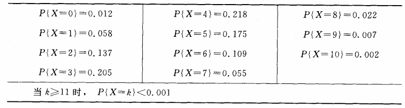
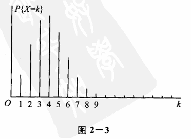

# 第二章 随机变量及其分布  

## §2 离散型随机变量及其分布律  
  
有些随机变量，它全部可能取到的值是有限个或可列无限多个，这种随机变量称为离散型随机变量。例如 §1 例 1 中的随机变量 $X $，它只可能取 $0, 1, 2, 3 $四个值，它是一个离散型随机变量。又如某城市的 $120 $急救电话台一昼夜收到的呼唤次数也是离散型随机变量。若以 $T $记某元件的寿命，它所可能取的值充满一个区间，是无法按一定次序一一列举出来的，因而它是一个非离散型的随机变量。本节只讨论离散型随机变量。  
  
容易知道，要掌握一个离散型随机变量 $X $的统计规律，必须且只需知道 $X $的所有可能取值以及取每一个可能值的概率。  
  
设离散型随机变量 $X $所有可能取的值为 $x_k (k = 1, 2, \cdots ) $， $X $取各个可能值的概率，即事件 $\lbrace X = x_k\rbrace $的概率，为  
  
  
 $$\begin{equation} P(X = x_k) = p_k, \quad k = 1, 2, \cdots \tag{2.1} \end{equation}  
 $$  
  
  
  
由概率的定义， $p_k $满足如下两个条件：  
  
  
 $$\begin{equation} 1^\circ \quad p_k \geq 0, \quad k = 1, 2, \cdots ; \tag{2.2} \end{equation}  
 $$  
  
  
  
  
 $$\begin{equation} 2^\circ \quad \sum_{k=1}^{\infty} p_k = 1. \tag{2.3} \end{equation}  
 $$  
  
  
  
  
 $$\begin{equation} 2^\circ \text{是由于} \lbrace X = x_1\rbrace \cup \lbrace X = x_2\rbrace \cup \cdots \text{是必然事件，且} \lbrace X = x_j\rbrace \cap \lbrace X = x_k\rbrace = \emptyset, \quad k \neq j, \text{故} 1 = P[\bigcup_{k=1}^{\infty} \lbrace X = x_k\rbrace] = \sum_{k=1}^{\infty} P\lbrace X = x_k\rbrace, \text{即} \sum_{k=1}^{\infty} p_k = 1. \end{equation}  
 $$  
  
  
  
我们称（2.1）式为离散型随机变量 $X $的分布律。分布律也可以用表格的形式来表示  
  
  
 $$\begin{equation}  
\begin{array}{c|cccc}  
X & x_1 & x_2 & \cdots & x_n & \cdots \\  
\hline  
p_k & p_1 & p_2 & \cdots & p_n & \cdots 
\end{array} \tag{2.4}  
\end{equation}  
 $$  
  
  
(2.4)直观地表示了随机变量 $X $取各个值的概率的规律。 $X $取各个值各占一些概率，这些概率合起来是 $1 $。可以想像成：概率 $1 $以一定的规律分布在各个可能值上。这就是(2.4)称为分布律的缘故。  
  
**例1** 设一汽车在开往目的地的道路上需经过四组信号灯，每组信号灯以 $1/2 $的概率允许或禁止汽车通过。以 $X $表示汽车首次停下时，它已通过的信号灯的组数（设备组信号灯的工作是相互独立的），求 $X $的分布律。  
  
**解** 以 $p $表示每组信号灯禁止汽车通过的概率，易知 $X $的分布律为  
  
 $$  
\begin{equation}  
\begin{array}{cccccc}  
X & 0 & 1 & 2 & 3 & 4 \\  
p_k & p & (1-p) p & (1-p)^2 p & (1-p)^3 & (1-p)^4 \\  
\end{array}  
\end{equation}  
 $$  
  
或写成  
  
  
  
 $$\begin{equation} P(X=k) = (1-p)^k p, \quad k=0,1,2,3, \quad P(X=4) = (1-p)^4. \end{equation}  
 $$  
  
  
  
以 $p = 1/2 $代入得  
  
  
  
 $$\begin{equation}  
\begin{array}{cccccc}  
X & 0 & 1 & 2 & 3 & 4 \\  
p_k & 0.5 & 0.25 & 0.125 & 0.0625 & 0.0625 \\  
\end{array}  
\end{equation}  
 $$  
  
  
  
### 知识点扩展与讲解：  
  
**一、离散型随机变量的定义**  
  
随机变量是对随机试验结果的数值描述。有些随机变量，它全部可能取到的值是有限个或可列无限多个，这种随机变量就称为离散型随机变量。  
  
比如在之前提到的§1例1中的随机变量 $X $，它只可能取 $0, 1, 2, 3 $这四个值，这就是一个典型的离散型随机变量的例子。再如某城市的 $120 $急救电话台一昼夜收到的呼唤次数，这个次数也是可以逐个列举出来的，可能是0次、1次、2次等等，所以它也是离散型随机变量。  
  
而与之相对的，像以 $T $记某元件的寿命，它所可能取的值充满一个区间，没办法按照一定的次序一一列举出来，这种就是非离散型的随机变量。在本节中，我们重点关注的是离散型随机变量。  
  
**二、掌握离散型随机变量的统计规律所需条件**  
  
要全面掌握一个离散型随机变量 $X $的统计规律，必须且只需知道两件事：一是 $X $的所有可能取值，二是取每一个可能值的概率。  
  
**三、离散型随机变量的分布律**  
  
设离散型随机变量 $X $所有可能取的值为 $x_k (k = 1, 2, \cdots ) $， $X $取各个可能值的概率，也就是事件 $\lbrace X = x_k\rbrace $的概率，记为 $P(X = x_k) = p_k, \quad k = 1, 2, \cdots $，这就是离散型随机变量 $X $的分布律的表达式（2.1）。  
  
这里的 $p_k $需要满足两个条件：  
1. 由概率的定义可知， $p_k \geq 0, \quad k = 1, 2, \cdots $（条件2.2），因为概率值是不能为负的，它表示某个事件发生的可能性大小，最小就是0，表示不可能发生。  
2. 由于 $\lbrace X = x_1\rbrace \cup \lbrace X = x_2\rbrace \cup \cdots $是必然事件（也就是说 $X $肯定会取到它所有可能取值中的某一个），且 $\lbrace X = x_j\rbrace \cap \lbrace X = x_k\rbrace = \emptyset, \quad k \neq j $（即 $X $每次只能取一个值，不同取值对应的事件是互斥的），所以根据概率的可加性，就有 $1 = P[\bigcup_{k=1}^{\infty} \lbrace X = x_k\rbrace] = \sum_{k=1}^{\infty} P\lbrace X = x_k\rbrace $，也就是 $\sum_{k=1}^{\infty} p_k = 1 $（条件2.3）。  
  
分布律还可以用表格的形式（2.4）来表示，这种表格形式很直观地展示了随机变量 $X $取各个值的概率的规律。可以想象成概率 $1 $按照一定的规律分布在各个可能值上，这就是它被称为分布律的原因。  
  
**四、例题讲解**  
  
在例1中，设一汽车在开往目的地的道路上需经过四组信号灯，每组信号灯以 $1/2 $的概率允许或禁止汽车通过。以 $X $表示汽车首次停下时，它已通过的信号灯的组数（且每组信号灯的工作是相互独立的），来求 $X $的分布律。  
  
解题思路是这样的：首先确定以 $p $表示每组信号灯禁止汽车通过的概率，这里已知每组信号灯禁止通过的概率为 $1/2 $，即 $p = 1/2 $。  
  
当 $X = 0 $时，就是第一组信号灯就禁止汽车通过了，所以其概率就是 $p $。  
  
当 $X = 1 $时，意味着第一组信号灯允许通过（概率为 $1- p $），然后第二组信号灯禁止通过（概率为 $p $），由于每组信号灯工作相互独立，所以这种情况发生的概率就是 $(1- p) p $。  
  
同理，当 $X = 2 $时，就是前两组信号灯允许通过（概率都是 $1- p $），第三组信号灯禁止通过（概率为 $p $），其概率为 $(1- p)^2 p $。  
  
当 $X = 3 $时，前三组信号灯都允许通过（概率都是 $1- p $），第四组信号灯禁止通过（概率为 $p $），概率为 $(1- p)^3 p $。  
  
当 $X = 4 $时，就是四组信号灯都允许汽车通过，其概率为 $(1- p)^4 $。  
  
最后把 $p = 1/2 $代入，就得到了具体的分布律表格形式的结果。  
  
**一、选择题题目**  
  
1. 以下关于离散型随机变量的说法，正确的是（  ）  
    -   A. 其可能取值一定是有限个  
    -   B. 其可能取值一定是可列无限多个  
    -   C. 其可能取值是有限个或可列无限多个  
    -   D. 其可能取值是任意实数  
  
答案：C  
解析：离散型随机变量全部可能取到的值是有限个或可列无限多个，这是离散型随机变量的定义内容，所以C选项正确，A、B选项说法太片面，D选项描述的是一般随机变量的取值范围，不符合离散型随机变量的特点。  
  
2. 若离散型随机变量 $X $的所有可能取值为 $x_k (k = 1, 2, \cdots ) $，那么事件 $\lbrace X = x_k\rbrace $的概率记为（  ）  
    -   A. $P(X \neq x_k) $  
    -   B. $P(X = x_k) = p_k $  
    -   C. $P(X \geq x_k) $  
    -   D. $P(X \leq x_k) $  
  
答案：B  
解析：根据离散型随机变量分布律的定义，设离散型随机变量 $X $所有可能取的值为 $x_k (k = 1, 2, \cdots ) $， $X $取各个可能值的概率，即事件 $\lbrace X = x_k\rbrace $的概率，记为 $P(X = x_k) = p_k, \quad k = 1, 2, \cdots $，所以B选项正确。  
  
3. 离散型随机变量 $X $的分布律中， $p_k $满足的条件不包括（  ）  
    -   A. $p_k \geq 0, \quad k = 1, 2, \cdots $  
    -   B. $\sum_{k=1}^{\infty} p_k = 1 $  
    -   C. $p_k \leq 1, \quad k = 1, 2, \cdots $  
    -   D. 以上选项都是分布律中 $p_k $满足的条件  
  
答案：C  
解析：离散型随机变量的分布律中，由概率的定义， $p_k $满足 $p_k \geq 0, \quad k = 1, 2, \cdots $以及 $\sum_{k=1}^{\infty} p_k = 1 $，并没有 $p_k \leq 1 $这个单独作为必须满足的条件（虽然概率本身是小于等于1的，但在分布律里强调的是前面两个条件），所以C选项符合题意。  
  
4. 对于离散型随机变量 $X $，若其分布律用表格表示，表格中的行分别表示（  ）  
    -   A. 随机变量 $X $的取值和对应的概率  
    -   B. 仅随机变量 $X $的取值  
    -   C. 仅随机变量 $X $取各个值的概率  
    -   D. 随机变量 $X $的取值范围和概率范围  
  
答案：A  
解析：离散型随机变量的分布律用表格表示时，一行是随机变量 $X $的各个可能取值，另一行是对应的取各个值的概率，所以表格中的行分别表示随机变量 $X $的取值和对应的概率，A选项正确。  
  
5. 已知离散型随机变量 $X $的分布律为：  
  
 $$  
\begin{equation}  
\begin{array}{c|cccc}  
X & 1 & 2 & 3 & 4 \\  
\hline  
p_k & 0.2 & 0.3 & 0.4 & 0.1  
\end{array}  
\end{equation}  
 $$  
  
那么 $P(X = 3) $的值为（  ）  
    -   A. 0.2  
    -   B. 0.3  
    -   C. 0.4  
    -   D. 0.1  
  
答案：C  
解析：根据所给的离散型随机变量 $X $的分布律表格，表格中对应 $X = 3 $这一列的概率值就是 $P(X = 3) $的值，从表格中可以看出为0.4，所以C选项正确。  
  
6. 设离散型随机变量 $X $的所有可能取值为 $x_1, x_2, x_3 $，其分布律为 $P(X = x_1) = 0.3 $， $P(X = x_2) = 0.5 $，那么 $P(X = x_3) $的值为（  ）  
    -   A. 0.1  
    -   B. 0.2  
    -   C. 0.3  
    -   D. 0.4  
  
答案：B  
解析：因为离散型随机变量的分布律满足 $\sum_{k=1}^{\infty} p_k = 1 $，这里 $X $的所有可能取值为 $x_1, x_2, x_3 $，已知 $P(X = x_1) = 0.3 $， $P(X = x_2) = 0.5 $，那么 $P(X = x_3)=1- P(X = x_1)-P(X = x_2)=1- 0.3- 0.5 = 0.2 $，所以B选项正确。  
  
7. 下列哪个随机变量是离散型随机变量（  ）  
    -   A. 某水库的水位高度  
    -   B. 某电子元件的使用寿命  
    -   C. 某超市一天内顾客的人数  
    -   D. 某地区一天内的气温变化  
  
答案：C  
解析：离散型随机变量是其全部可能取到的值是有限个或可列无限多个的随机变量。某超市一天内顾客的人数是可以逐个列举出来的，比如0人、1人、2人等等，是离散型随机变量。而某水库的水位高度、某电子元件的使用寿命、某地区一天内的气温变化所可能取的值充满一个区间，无法按一定次序一一列举出来，属于非离散型随机变量，所以C选项正确。  
  
8. 离散型随机变量 $X $的分布律中，若 $p_1 = 0.2 $， $p_2 = 0.3 $，且 $\sum_{k=1}^{\infty} p_k = 1 $，那么除了 $p_1 $和 $p_2 $之外的其他 $p_k $（ $k \geq 3 $）的和为（  ）  
    -   A. 0.5  
    -   B. 0.4  
    -   C. 0.6  
    -   D. 0.3  
  
答案：A  
解析：已知离散型随机变量 $X $的分布律满足 $\sum_{k=1}^{\infty} p_k = 1 $，现在已知 $p_1 = 0.2 $， $p_2 = 0.3 $，那么除了 $p_1 $和 $p_2 $之外的其他 $p_k $（ $k \geq 3 $）的和为 $1- p_1- p_2 = 1- 0.2- 0.3 = 0.5 $，所以A选项正确。  
  
9. 对于离散型随机变量 $X $，其分布律为 $P(X = k) = \frac{1}{k(k + 1)}, k = 1, 2, \cdots $，则 $P(X \leq 3) $的值为（  ）  
    -   A. $\frac{1}{2} $  
    -   B. $\frac{3}{4} $  
    -   C. $\frac{11}{12} $  
    -   D. $\frac{2}{3} $  
  
答案：B  
解析：要求 $P(X \leq 3) $，即求 $P(X = 1)+P(X = 2)+P(X = 3) $。已知 $P(X = k) = \frac{1}{k(k + 1)}=\frac{1}{k}-\frac{1}{k + 1} $，所以 $P(X = 1)=\frac{1}{1\times(1 + 1)}=\frac{1}{2} $， $P(X = 2)=\frac{1}{2\times(2 + 1)}=\frac{1}{6} $， $P(X = 3)=\frac{1}{3\times(3 + 1)}=\frac{1}{12} $，则 $P(X \leq 3)=\frac{1}{2}+\frac{1}{6}+\frac{1}{12}=\frac{6 + 2 + 1}{12}=\frac{9}{12}=\frac{3}{4} $，所以B选项正确。  
  
10. 设离散型随机变量 $X $的分布律为：  
  
 $$  
\begin{equation}  
\begin{array}{c|cccc}  
X & 0 & 1 & 2 & 3 \\  
\hline  
p_k & 0.1 & 0.3 & 0.4 & 0.2  
\end{array}  
\end{equation}  
 $$  
  
那么 $P(X \geq 2) $的值为（  ）  
    -   A. 0.4  
    -   B. 0.6  
    -   C. 0.7  
    -   D. 0.8  
  
答案：B  
解析：要求 $P(X \geq 2) $，即求 $P(X = 2)+P(X = 3) $，从分布律表格中可知 $P(X = 2)=0.4 $， $P(X = 3)=0.2 $，所以 $P(X \geq 2)=0.4 + 0.2 = 0.6 $，所以B选项正确。  
  
11. 离散型随机变量 $X $的分布律中，若 $p_3 = 0.1 $，且 $\sum_{k=1}^{\infty} p_k = 1 $，已知 $p_1 = 0.3 $， $p_2 = 0.4 $，那么除了 $p_1 $、 $p_2 $和 $p_3 $之外的其他 $p_k $（ $k \geq 4 $）的和为（  ）  
    -   A. 0.2  
    -   B. 0.3  
    -   C. 0.1  
    -   D. 0.4  
  
答案：A  
解析：因为离散型随机变量的分布律满足 $\sum_{k=1}^{\infty} p_k = 1 $，已知 $p_1 = 0.3 $， $p_2 = 0.4 $， $p_3 = 0.1 $，那么除了 $p_1 $、 $p_2 $和 $p_3 $之外的其他 $p_k $（ $k \geq 4 $）的和为 $1- p_1- p_2- p_3 = 1- 0.3- 0.4- 0.1 = 0.2 $，所以A选项正确。  
  
12. 以下关于离散型随机变量分布律用表格表示的说法，错误的是（  ）  
    -   A. 表格的第一行列出随机变量 $X $的所有可能取值  
    -   B. 表格的第二行列出对应取值的概率  
    -   C. 表格中随机变量 $X $的取值必须按从小到大的顺序排列  
    -   D. 表格可以直观地表示随机变量 $X $取各个值的概率规律  
  
答案：C  
解析：离散型随机变量分布律用表格表示时，表格的第一行列出随机变量 $X $的所有可能取值，第二行列出对应取值的概率，表格可以直观地表示随机变量 $X $取各个值的概率规律。但是表格中随机变量 $X $的取值并不一定非要按从小到大的顺序排列，也可以按其他顺序，只要能明确对应关系即可，所以C选项说法错误。  
  
13. 设离散型随机变量 $X $的分布律为 $P(X = k) = \frac{1}{2^k}, k = 1, 2, \cdots $，则 $P(X \leq 2) $的值为（  ）  
    -   A. $\frac{3}{4} $  
    -   B. $\frac{5}{8} $  
    -   C. $\frac{7}{8} $  
    -   D. $\frac{1}{2} $  
  
答案：A  
解析：要求 $P(X \leq 2) $，即求 $P(X = 1)+P(X = 2) $。已知 $P(X = k) = \frac{1}{2^k} $，所以 $P(X = 1)=\frac{1}{2^1}=\frac{1}{2} $， $P(X = 2)=\frac{1}{2^2}=\frac{1}{4} $，则 $P(X \leq 2)=\frac{1}{2}+\frac{1}{4}=\frac{2 + 1}{4}=\frac{3}{4} $，所以A选项正确。  
  
14. 离散型随机变量 $X $的分布律为：  
  
 $$  
\begin{equation}  
\begin{array}{c|cccc}  
X &-1 & 0 & 1 & 2 \\  
\hline  
p_k & 0.1 & 0.3 & 0.4 & 0.2  
\end{array}  
\end{equation}  
 $$  
  
那么 $P(X \neq 0) $的值为（  ）  
    -   A. 0.1  
    -   B. 0.3  
    -   C. 0.7  
    -   D. 0.9  
  
答案：C  
解析：要求 $P(X \neq 0) $，即求 $1- P(X = 0) $，从分布律表格中可知 $P(X = 0)=0.3 $，所以 $P(X \neq 0)=1- 0.3 = 0.7 $，所以C选项正确。  
  
16. 离散型随机变量 $X $的分布律为：  
  
 $$  
\begin{equation}  
\begin{array}{c|cccc}  
X & 1 & 2 & 3 & 4 \\  
\hline  
p_k & 0.2 & 0.3 & 0.4 & 0.1  
\end{array}  
\end{equation}  
 $$  
  
那么 $P(X \geq 1) $的值为（  ）  
    -   A. 0.2  
    -   B. 0.3  
    -   C. 0.4  
    -   D. 1  
  
答案：D  
解析：因为 $X $的所有可能取值为 $1, 2, 3, 4 $，所以 $P(X \geq 1) $就是 $X $取到任何一个可能值的概率，其必然等于1，所以D选项正确。  
  
17. 设离散型随机变量 $X $的分布律为 $P(X = k) = \frac{1}{3^k}, k = 1, 2, \cdots $，则 $P(X \leq 4) $的值为（  ）  
    -   A. $\frac{40}{81} $  
    -   B. $\frac{120}{121} $  
    -   C. $\frac{160}{161} $  
    -   D. $\frac{200}{201} $  
  
答案：A  
解析：要求 $P(X \leq 4) $，即求 $P(X = 1)+P(X = 2)+P(X = 3)+P(X = 4) $。已知 $P(X = k) = \frac{1}{3^k} $，所以 $P(X = 1)=\frac{1}{3^1}=\frac{1}{3} $， $P(X = 2)=\frac{1}{3^2}=\frac{1}{9} $， $P(X = 3)=\frac{1}{3^3}=\frac{1}{27} $， $P(X = 4)=\frac{1}{3^4}=\frac{1}{81} $，则 $P(X \leq 4)=\frac{1}{3}+\frac{1}{9}+\frac{1}{27}+\frac{1}{81}=\frac{27 + 9 + 3 + 1}{81}=\frac{40}{81} $，所以A选项正确。  
  
18. 离散型随机变量 $X $的分布律为：  
  
 $$  
\begin{equation}  
\begin{array}{c|cccc}  
X & 0 & 1 & 2 & 3 \\  
\hline  
p_k & 0.1 & 0.3 & 0.4 & 0.2  
\end{array}  
\end{equation}  
 $$  
  
那么 $P(X = 1 \text{或 } X = 3) $的值为（  ）  
    -   A. 0.1  
    -   B. 0.3  
    -   C. 0.5  
    -   D. 0.6  
  
答案：C  
解析：要求 $P(X = 1 \text{或 } X = 3) $，即求 $P(X = 1)+P(X = 3) $，从分布律表格中可知 $P(X = 1)=0.3 $， $P(X = 3)=0.2 $，所以 $P(X = 1 \text{或 } X = 3)=0.3 + 0.2 = 0.5 $，所以C选项正确。  
  
19. 设离散型随机变量 $X $的分布律为 $P(X = k) = \frac{2}{k(k + 1)}, k = 2, 3, \cdots $，则 $P(X \leq 5) $的值为（  ）  
    -   A. $\frac{9}{5} $  
    -   B. $\frac{19}{15} $  
    -   C. $\frac{2}{3} $  
    -   D. $\frac{9}{10} $  
  
答案：C  
解析：要求 $P(X \leq 5) $，即求 $P(X = 2)+P(X = 3)+P(X = 4)+P(X = 5) $。  
  
已知 $P(X = k) = \frac{2}{k(k + 1)} = 2(\frac{1}{k}- \frac{1}{k + 1}) $，则：  
  
 $P(X = 2)=2(\frac{1}{2}- \frac{1}{2 + 1}) = 2\times(\frac{1}{2}- \frac{1}{3}) = 2\times\frac{1}{6} = \frac{1}{3} $；  
  
 $P(X = 3)=2(\frac{1}{3}- \frac{1}{3 + 1}) = 2\times(\frac{1}{3}- \frac{1}{4}) = 2\times\frac{1}{12} = \frac{1}{6} $；  
  
 $P(X = 4)=2(\frac{1}{4}- \frac{1}{4 + 1}) = 2\times(\frac{1}{4}- \frac{1}{5}) = 2\times\frac{1}{20} = \frac{1}{10} $；  
  
 $P(X = 5)=2(\frac{1}{5}- \frac{1}{5 + 1}) = 2\times(\frac{1}{5}- \frac{1}{6}) = 2\times\frac{1}{30} = \frac{1}{15} $。  
  
所以 $P(X \leq 5)=\frac{1}{3} + \frac{1}{6} + \frac{1}{10} + \frac{1}{15} $  
 $=\frac{10 + 5 + 3 + 2}{30}=\frac{20}{30}=\frac{2}{3} $（约分得到），故C选项正确。  
  
20. 离散型随机变量 $X $的分布律为：  
  
 $$  
\begin{equation}  
\begin{array}{c|cccc}  
X &-2 &-1 & 0 & 1 \\  
\hline  
p_k & 0.1 & 0.2 & 0.3 & 0.4  
\end{array}  
\end{equation}  
 $$  
  
那么 $P(X \geq-1) $的值为（  ）  
    -   A. 0.2  
    -   B. 0.3  
    -   C. 0.6  
    -   D. 0.9  
  
答案：D  
解析：要求 $P(X \geq-1) $，即求 $P(X =-1)+P(X = 0)+P(X = 1) $。  
  
从分布律表格中可知 $P(X =-1)=0.2 $， $P(X = 0)=0.3 $， $P(X = 1)=0.4 $，  
  
所以 $P(X \geq-1)=0.2 + 0.3 + 0.4 = 0.9 $，故D选项正确。  
  
### 扩展讲解  
  
离散型随机变量是指其所有可能取值是有限个或可列无限多个的随机变量。这类随机变量的特点是可以将其所有可能取值一一列举出来。例如，掷一枚硬币的结果（正面或反面）、某城市的120急救电话台一昼夜收到的呼唤次数等都是离散型随机变量的例子。  
  
要掌握一个离散型随机变量 $X $的统计规律，必须知道 $X $的所有可能取值以及取每一个可能值的概率。设离散型随机变量 $X $所有可能取的值为 $x_k (k = 1, 2, \cdots ) $， $X $取各个可能值的概率，即事件 $\lbrace X = x_k\rbrace $的概率，为  
  
  
  
 $$\begin{equation} P(X = x_k) = p_k, \quad k = 1, 2, \cdots \end{equation}  
 $$  
  
  
  
其中， $p_k $满足以下两个条件：  
  
1. $p_k \geq 0, \quad k = 1, 2, \cdots $  
2. $\sum_{k=1}^{\infty} p_k = 1 $  
  
第二个条件是由于 $\lbrace X = x_1\rbrace \cup \lbrace X = x_2\rbrace \cup \cdots $是必然事件，且 $\lbrace X = x_j\rbrace \cap \lbrace X = x_k\rbrace = \emptyset, \quad k \neq j $，故  
  
  
  
 $$\begin{equation} 1 = P[\bigcup_{k=1}^{\infty} \lbrace X = x_k\rbrace] = \sum_{k=1}^{\infty} P\lbrace X = x_k\rbrace, \text{即} \sum_{k=1}^{\infty} p_k = 1 \end{equation}  
 $$  
  
  
  
我们称上述公式为离散型随机变量 $X $的分布律。分布律也可以用表格的形式来表示：  
  
  
  
 $$\begin{equation}  
\begin{array}{c|cccc}  
X & x_1 & x_2 & \cdots & x_n & \cdots \\  
\hline  
p_k & p_1 & p_2 & \cdots & p_n & \cdots 
\end{array}  
\end{equation}  
 $$  
  
  
  
### 例题  
  
**例1** 设一汽车在开往目的地的道路上需经过四组信号灯，每组信号灯以 $1/2 $的概率允许或禁止汽车通过。以 $X $表示汽车首次停下时，它已通过的信号灯的组数（设备组信号灯的工作是相互独立的），求 $X $的分布律。  
  
**解** 以 $p $表示每组信号灯禁止汽车通过的概率，易知 $X $的分布律为：  
  
  
  
 $$\begin{equation}  
\begin{array}{cccccc}  
X & 0 & 1 & 2 & 3 & 4 \\  
p_k & p & (1-p)p & (1-p)^2 p & (1-p)^3 & (1-p)^4 \\  
\end{array}  
\end{equation}  
 $$  
  
  
  
或写成：  
  
  
  
 $$\begin{equation} P(X=k) = (1-p)^k p, \quad k=0,1,2,3, \quad P(X=4) = (1-p)^4 \end{equation}  
 $$  
  
  
  
以 $p = 1/2 $代入得：  
  
  
  
 $$\begin{equation}  
\begin{array}{cccccc}  
X & 0 & 1 & 2 & 3 & 4 \\  
p_k & 0.5 & 0.25 & 0.125 & 0.0625 & 0.0625 \\  
\end{array}  
\end{equation}  
 $$  
  
  
  
### 选择题  
  
1. 离散型随机变量 $X $的所有可能取值是有限个或可列无限多个，以下哪个选项不是离散型随机变量的例子？  
    -   A. 掷一枚硬币的结果  
    -   B. 某城市的 120 急救电话台一昼夜收到的呼唤次数  
    -   C. 某元件的寿命  
    -   D. 掷一个六面骰子的结果  
  
    **答案**：C  
  
    **解释**：某元件的寿命是一个连续型随机变量，因为它可能取值充满一个区间，无法按一定次序一一列举出来。  
  
2. 离散型随机变量 $X $的分布律满足以下哪个条件？  
    -   A. $p_k \leq 0, \quad k = 1, 2, \cdots $  
    -   B. $\sum_{k=1}^{\infty} p_k = 0 $  
    -   C. $p_k \geq 0, \quad k = 1, 2, \cdots $  
    -   D. $\sum_{k=1}^{\infty} p_k = 2 $  
  
    **答案**：C  
  
    **解释**：离散型随机变量的分布律要求 $p_k \geq 0 $且 $\sum_{k=1}^{\infty} p_k = 1 $。  
  
3. 设离散型随机变量 $X $的分布律为 $P(X=k) = (1-p)^k p, \quad k=0,1,2,3 $，则 $P(X=4) $等于多少？  
    -   A. $p $  
    -   B. $(1-p)^4 $  
    -   C. $p^4 $  
    -   D. $(1-p)^3 p $  
  
    **答案**：B  
  
    **解释**：根据分布律的定义， $P(X=4) = (1-p)^4 $。  
  
4. 设 $X $是一个离散型随机变量，其分布律为 $P(X=k) = \frac{1}{2^k}, \quad k=1,2,3,\cdots $，则 $\sum_{k=1}^{\infty} P(X=k) $等于多少？  
    -   A. 0  
    -   B. 1  
    -   C. 2  
    -   D. $\infty $  
  
    **答案**：B  
  
    **解释**：这是一个几何级数求和问题， $\sum_{k=1}^{\infty} \frac{1}{2^k} = 1 $。  
  
5. 设 $X $是一个离散型随机变量，其分布律为 $P(X=k) = \frac{1}{k(k+1)}, \quad k=1,2,3,\cdots $，则 $\sum_{k=1}^{\infty} P(X=k) $等于多少？  
    -   A. 0  
    -   B. 1  
    -   C. 2  
    -   D. $\infty $  
  
    **答案**：B  
  
    **解释**：这是一个部分分式分解问题， $\sum_{k=1}^{\infty} \frac{1}{k(k+1)} = 1 $。  
  
6. 设 $X $是一个离散型随机变量，其分布律为 $P(X=k) = \frac{1}{k!}, \quad k=0,1,2,\cdots $，则 $\sum_{k=0}^{\infty} P(X=k) $等于多少？  
    -   A. 0  
    -   B. 1  
    -   C. $e $  
    -   D. $\infty $  
  
    **答案**：C  
  
    **解释**：这是一个指数级数求和问题， $\sum_{k=0}^{\infty} \frac{1}{k!} = e $。  
  
7. 设 $X $是一个离散型随机变量，其分布律为 $P(X=k) = \frac{1}{2^k}, \quad k=1,2,3,\cdots $，则 $P(X=1) $等于多少？  
    -   A. $\frac{1}{2} $  
    -   B. $\frac{1}{4} $  
    -   C. $\frac{1}{8} $  
    -   D. $\frac{1}{16} $  
  
    **答案**：A  
  
    **解释**：根据分布律的定义， $P(X=1) = \frac{1}{2} $。  
  
### 知识点扩展讲解  
  
离散型随机变量是概率论中的一种基本类型，它与连续型随机变量相对。离散型随机变量的特点在于其可能取的值是可数的，这包括有限个值或可列无限多个值。例如，抛硬币的结果（正面或反面）、掷骰子的结果（1到6的点数）都是离散型随机变量的例子。  
  
离散型随机变量的分布律可以通过概率质量函数（PMF）来描述，该函数为每个可能的值分配一个概率。这些概率必须满足两个条件：每个概率值非负，且所有概率值的和为1。  
  
### 选择题  
  
1. 离散型随机变量的定义是：  
    -   A. 只能取有限个值  
    -   B. 值可以是任何实数  
    -   C. 取值可以一一列举  
    -   D. 取值充满一个区间  
   **答案：C**  
   **解析：** 离散型随机变量的特点是其所有可能的取值可以一一列举出来，无论是有限个还是可列无限多个。  
  
2. 离散型随机变量 $X $的概率质量函数 $P(X = x_k) $必须满足的条件是：  
    -   A. $p_k < 0 $  
    -   B. $\sum_{k=1}^{\infty} p_k < 1 $  
    -   C. $p_k \geq 0 $且 $\sum_{k=1}^{\infty} p_k = 1 $  
    -   D. $p_k $可以是任何实数  
   **答案：C**  
   **解析：** 概率质量函数的值必须非负，且所有可能值的概率之和必须等于1。  
  
3. 如果离散型随机变量 $X $可以取值 $x_1, x_2, \ldots $，则 $X $的分布律可以表示为：  
    -   A. $P(X = x_k) = p_k $  
    -   B. $P(X \leq x_k) = p_k $  
    -   C. $P(X > x_k) = p_k $  
    -   D. $P(X \geq x_k) = p_k $  
   **答案：A**  
   **解析：** 分布律直接给出了随机变量取每个特定值的概率。  
  
4. 对于离散型随机变量，以下哪个条件是正确的：  
    -   A. 所有可能值的概率之和可以大于1  
    -   B. 可以有多个值的概率为0  
    -   C. 所有可能值的概率之和必须等于1  
    -   D. 每个值的概率可以是负数  
   **答案：C**  
   **解析：** 离散型随机变量的所有可能值的概率之和必须等于1，这是概率的基本规则。  
  
17. 如果离散型随机变量 $X $的所有可能值的概率之和不等于1，那么：  
    -   A. 这是可能的，因为概率可以超过1  
    -   B. 这是不可能的，因为违反了概率的基本规则  
    -   C. 这是可能的，因为概率可以是负数  
    -   D. 这是可能的，因为概率可以是任何实数  
    **答案：B**  
    **解析：** 所有可能值的概率之和必须等于1，这是概率论的基本规则。  
  
18. 离散型随机变量 $X $的期望值 $E(X) $可以通过以下公式计算：  
    -   A. $E(X) = \sum_{k=1}^{\infty} x_k p_k $  
    -   B. $E(X) = \prod_{k=1}^{\infty} x_k p_k $  
    -   C. $E(X) = \max(x_k) $  
    -   D. $E(X) = \min(x_k) $  
    **答案：A**  
    **解析：** 期望值是每个可能值乘以其概率的总和。  
  
19. 如果离散型随机变量 $X $的分布律是 $P(X = x_k) = p_k $，那么 $X $的方差 $\text{Var}(X) $可以通过以下公式计算：  
    -   A. $\text{Var}(X) = \sum_{k=1}^{\infty} [x_k- E(X)]^2 p_k $  
    -   B. $\text{Var}(X) = E\lbrace [X- E(X)]^2 \rbrace $  
    -   C. $\text{Var}(X) = E(X^2)- [E(X)]^2 $  
    -   D. 所有上述公式都是正确的  
  
    **答案：D**  
    **解析：** 方差可以通过直接计算 $(x_k- E(X))^2 $的期望值或通过 $E(X^2)- [E(X)]^2 $来计算。  
  
20. 离散型随机变量 $X $的累积分布函数 $F(x) $定义为：  
    -   A. $F(x) = P(X \leq x) $  
    -   B. $F(x) = P(X > x) $  
    -   C. $F(x) = P(X = x) $  
    -   D. $F(x) = 1- P(X \leq x) $  
    **答案：A**  
    **解析：** 累积分布函数 $F(x) $给出了随机变量 $X $取值小于或等于 $x $的概率。  
  
下面介绍三种重要的离散型随机变量。  
  
### （一）（0-1）分布  
  
设随机变量 $X $只可能取 $0 $与 $1 $两个值，它的分布律是  
  
  
 $$  
 \begin{equation} P\lbrace X=k\rbrace = p^k (1-p)^{1-k}, \quad k=0,1 \quad (0<p<1),  
 \end{equation}  
 $$  
  
  
则称 $X $服从以 $p $为参数的（0-1）分布或两点分布。  
（0-1）分布的分布律也可写成  
  
  
 $$  
 \begin{equation}  
\begin{array}{c|cc}  
X & 0 & 1 \\  
\hline  
p_k & 1-p & p  
\end{array}  
\end{equation}  
 $$  
  
  
  
对于一个随机试验，如果它的样本空间只包含两个元素，即 $S=\lbrace e_1, e_2\rbrace $，我们总能在 $S $上定义一个服从（0-1）分布的随机变量  
  
  
 $$\begin{equation} X=X(e)=\left\lbrace \begin{array}{ll}  
0, & \text{当 } e=e_1, \\  
1, & \text{当 } e=e_2  
\end{array}\right. \end{equation}  
 $$  
  
  
来描述这个随机试验的结果。例如，对新生婴儿的性别进行登记，检查产品的质量是否合格，某车间的电力消耗是否超过负荷以及前面多次讨论过的“抛硬币”试验等都可以用（0-1）分布的随机变量来描述。（0-1）分布是经常遇到的一种分布。  
  
### （二）伯努利试验、二项分布  
  
设试验 $E $只有两个可能结果： $A $及 $\overline{A} $，则称 $E $为伯努利（Bernoulli）试验。设 $P(A)=p \quad (0<p<1) $，此时 $P(\overline{A})=1-p $。将 $E $独立重复地进行 $n $次，则称这一串重复的独立试验为 $n $重伯努利试验。  
这里“重复”是指在每次试验中 $P(A)=p $保持不变；“独立”是指各次试验  
  
的结果互不影响，即若以 $C_i $记第 $i $次试验的结果， $C_i $为 $A $或 $\overline{A} $， $i=1,2,\cdots ,n $。 “独立”是指  
  
  
 $$\begin{equation} P(C_1C_2\cdots C_n) = P(C_1)P(C_2)\cdots P(C_n). \tag{2.5} \end{equation}  
 $$  
  
  
 $n $重伯努利试验是一种很重要的数学模型，它有广泛的应用，是研究最多的模型之一。  
  
例如， $E $是抛一枚硬币观察得到正面或反面。 $A $表示得正面，这是一个伯努利试验。如将硬币抛 $n $次，就是 $n $重伯努利试验。又如抛一颗骰子，若 $A $表示得到“1点”， $\overline{A} $表示得到“非 1 点”。将骰子抛 $n $次，就是 $n $重伯努利试验。再如在袋中装有 $a $只白球， $b $只黑球。试验 $E $是在袋中任取一只球，观察其颜色。以 $A $表示“取到白球”， $P(A)=a/(a+b) $。若连续取球 $n $次作放回抽样，这就是 $n $重伯努利试验。然而，若作不放回抽样，虽则每次试验都有 $P(A)=a/(a+b) $（见第一章 §4 例 5），但各次试验不再相互独立③，因而不再是 $n $重伯努利试验了。  
  
以 $X $表示 $n $重伯努利试验中事件 $A $发生的次数， $X $是一个随机变量，我们来求它的分布律。 $X $所有可能取的值为 $0, 1, 2, \cdots , n $。由于各次试验是相互独立的，因此事件 $A $在指定的 $k $( $0 \leq k \leq n $) 次试验中发生，在其他 $n-k $次试验中 $A $不发生（例如在前 $k $次试验中 $A $发生，而后 $n-k $次试验中 $A $不发生）的概率为  
  
  
 $$\begin{equation} \frac{p \cdot p \cdot \cdots \cdot p}{k 个} \cdot \frac{(1-p) \cdot (1-p) \cdot \cdots \cdot (1-p)}{n-k 个} = p^k(1-p)^{n-k}. \end{equation}  
 $$  
  
  
这种指定的方式共有 $\binom{n}{k} $种，它们是两两互不相容的，故在 $n $次试验中 $A $发生 $k $次的概率为 $\binom{n}{k}p^k(1-p)^{n-k} $，记 $q=1-p $，即有  
  
  
 $$\begin{equation} P(X=k) = \binom{n}{k}p^kq^{n-k}, \quad k=0,1,2,\cdots ,n. \tag{2.6} \end{equation}  
 $$  
  
  
  
显然  
  
  
  
 $$\begin{equation} P(X = k) \geq 0, \quad k = 0, 1, 2, \cdots , n; \end{equation}  
 $$  
  
  
  
  
  
 $$\begin{equation} \sum_{k=0}^{n} P(X = k) = \sum_{k=0}^{n} \binom{n}{k} p^k q^{n-k} = (p + q)^n = 1. \end{equation}  
 $$  
  
  
  
③ 对于不放回抽样，以 $A_1,A_2 $分别记第一次、第二次取到白球，则有 $P(A_2|A_1) = \frac{a-1}{a+b-1} $，而  
  
  
  
 $$\begin{equation} P(A_2) = \frac{a}{a+b}, \quad P(A_2|A_1) \neq P(A_2), \end{equation}  
 $$  
  
  
  
故第一次、第二次试验不相独立。即知(2.5)不成立。  
  
即 $P\lbrace X=k\rbrace $满足条件 (2.2)、(2.3). 注意到 $\binom{n}{k} p^k q^{n-k} $刚好是二项式 $(p+q)^n $的展开式中出现 $p^k $的那一项, 我们称随机变量 $X $服从参数为 $n $, $p $的二项分布, 并记为 $X \sim b(n, p) $. 特别, 当 $n=1 $时二项分布 (2.6) 化为  
  
  
 $$\begin{equation} P\lbrace X=k\rbrace = p^k q^{1-k}, \quad k=0,1. \end{equation}  
 $$  
  
  
这就是 (0-1) 分布.  
  
### 知识点扩展与讲解：  
  
**（一）（0- 1）分布**  
  
**1. 定义**：  
设随机变量 $X $只可能取 $0 $与 $1 $两个值，它的分布律是 $P\lbrace X = k\rbrace = p^k(1- p)^{1- k}, \quad k = 0, 1 \quad (0 < p < 1) $，此时称 $X $服从以 $p $为参数的（0- 1）分布或两点分布。其分布律还可写成表格形式：  
 $$  
\begin{equation}  
\begin{array}{c|cc}  
X & 0 & 1 \\  
\hline  
p_k & 1- p & p  
\end{array}  
\end{equation}  
 $$  
  
**2. 实际意义**：  
对于一个随机试验，如果它的样本空间只包含两个元素，比如 $S = \lbrace e_1, e_2\rbrace $，我们就能在这个样本空间上定义一个服从（0- 1）分布的随机变量 $X $。例如，当对新生婴儿的性别进行登记时，可令 $X = 0 $表示女婴， $X = 1 $表示男婴；检查产品的质量是否合格，可令 $X = 0 $表示不合格， $X = 1 $表示合格；某车间的电力消耗是否超过负荷， $X = 0 $表示未超过， $X = 1 $表示超过；以及抛硬币试验， $X = 0 $表示反面， $X = 1 $表示正面等。这些情况都可以用（0- 1）分布的随机变量来描述，它是一种很常见的分布类型，能简洁地刻画只有两种可能结果的随机现象。  
  
**（二）伯努利试验、二项分布**  
  
**1. 伯努利试验**：  
设试验 $E $只有两个可能结果： $A $及 $\overline{A} $，则称 $E $为伯努利（Bernoulli）试验。设 $P(A) = p \quad (0 < p < 1) $，那么 $P(\overline{A}) = 1- p $。  
  
**2. $n $重伯努利试验**：  
将伯努利试验 $E $独立重复地进行 $n $次，则称这一串重复的独立试验为 $n $重伯努利试验。这里“重复”意味着在每次试验中 $P(A) = p $保持不变；“独立”是指各次试验的结果互不影响，即若以 $C_i $记第 $i $次试验的结果（ $C_i $为 $A $或 $\overline{A} $， $i = 1, 2, \cdots , n $），满足 $P(C_1C_2\cdots C_n) = P(C_1)P(C_2)\cdots P(C_n) $。例如抛一枚硬币观察得到正面或反面是一个伯努利试验，将硬币抛 $n $次就是 $n $重伯努利试验；抛一颗骰子，若 $A $表示得到“1点”， $\overline{A} $表示得到“非1点”，抛 $n $次骰子也是 $n $重伯努利试验；在袋中装有 $a $只白球， $b $只黑球，试验 $E $是在袋中任取一只球，观察其颜色，以 $A $表示“取到白球”，若连续取球 $n $次作放回抽样，这就是 $n $重伯努利试验，而不放回抽样时各次试验不再相互独立，就不是 $n $重伯努利试验了。  
  
**3. 二项分布**：  
以 $X $表示 $n $重伯努利试验中事件 $A $发生的次数， $X $是一个随机变量。由于各次试验是相互独立的，通过分析可知在 $n $次试验中 $A $发生 $k $次（ $0 \leq k \leq n $）的概率为 $\binom{n}{k}p^k(1- p)^{n- k} $，记 $q = 1- p $，即有 $P(X = k) = \binom{n}{k}p^kq^{n- k}, \quad k = 0, 1, 2, \cdots , n $。并且满足 $P(X = k) \geq 0, \quad k = 0, 1, 2, \cdots , n $以及 $\sum_{k = 0}^{n} P(X = k) = \sum_{k = 0}^{n} \binom{n}{k}p^kq^{n- k} = (p + q)^n = 1 $。我们称随机变量 $X $服从参数为 $n $， $p $的二项分布，并记为 $X \sim b(n, p) $。特别地，当 $n = 1 $时，二项分布就化为（0- 1）分布，即 $P\lbrace X = k\rbrace = p^kq^{1- k}, \quad k = 0, 1 $。  
  
### 选择题及答案：  
  
**一、选择题题目**  
  
1. 随机变量 $X $服从以 $p $为参数的（0- 1）分布，那么 $P(X = 0) $的值为（  ）  
    -   A. $p $  
    -   B. $1- p $  
    -   C. $p^2 $  
    -   D. $(1- p)^2 $  
  
2. 对于（0- 1）分布，以下哪种情况不适合用其来描述（  ）  
    -   A. 抛一枚骰子，观察得到的点数  
    -   B. 检查一盏灯是否亮着  
    -   C. 记录一次投篮是否命中  
    -   D. 判断一个人是否感染某种病毒（只有感染和未感染两种情况）  
  
3. 在（0- 1）分布中，若 $P(X = 1) = 0.6 $，则 $P(X = 0) $的值为（  ）  
    -   A. 0.4  
    -   B. 0.6  
    -   C. 0.2  
    -   D. 0.8  
  
4. 设试验 $E $只有两个可能结果： $A $及 $\overline{A} $，且 $P(A) = p $，将 $E $独立重复地进行 $n $次，这属于（  ）  
    -   A. 一次伯努利试验  
    -   B. $n $重伯努利试验  
    -   C. 二项分布试验  
    -   D. 普通试验  
  
5. 下列关于 $n $重伯努利试验的说法，错误的是（  ）  
    -   A. 每次试验结果只有两种可能  
    -   B. 各次试验相互独立  
    -   C. 每次试验中事件发生的概率会改变  
    -   D. 是一种常见的数学模型  
  
6. 在抛硬币试验中，设正面朝上为事件 $A $，抛 $5 $次硬币属于（  ）  
    -   A. 一次伯努利试验  
    -   B. $5 $重伯努利试验  
    -   C. 二项分布试验  
    -   D. 普通试验  
  
7. 若随机变量 $X $服从参数为 $n = 3 $， $p = 0.5 $的二项分布，那么 $X $所有可能取的值为（  ）  
    -   A. $0, 1, 2, 3 $  
    -   B. $-1, 0, 1 $  
    -   C. $0, 1, 2 $  
    -   D. $1, 2, 3 $  
  
8. 对于二项分布 $X \sim b(n, p) $， $P(X = k) $的计算公式为（  ）  
    -   A. $p^k(1- p)^{n- k} $  
    -   B. $\binom{n}{k}p^k(1- p)^{n- k} $  
    -   C. $p^k(1- p)^{1- k} $  
    -   D. $\binom{n}{k}p^{n- k}(1- p)^{k} $  
  
9. 在二项分布中，若 $n = 4 $， $p = 0.3 $，则 $P(X = 2) $的值为（  ）  
    -   A. $\binom{4}{2} \times 0.3^2 \times 0.7^2 $  
    -   B. $\binom{4}{2} \times 0.3^2 \times 0.7^4 $  
    -   C. $\binom{4}{2} \times 0.3^4 \times 0.7^2 $  
    -   D. $\binom{4}{2} \times 0.3^4 \times 0.7^4 $  
  
10. 设随机变量 $X $服从二项分布 $X \sim b(6, 0.4) $，那么 $P(X \leq 3) $的值为（  ）  
    -   A. $P(X = 0) + P(X = 1) + P(X = 2) + P(X = 3) $  
    -   B. $P(X = 3) $  
    -   C. $P(X = 4) + P(X = 5) + P(X = 6) $  
    -   D. $1- P(X = 0)- P(X = 1)- P(X = 2) $  
  
11. 下列关于（0- 1）分布和二项分布关系的说法，正确的是（  ）  
    -   A. 二项分布是（0- 1）分布的一种特殊情况  
    -   B. （0- 1）分布是二项分布的一种特殊情况  
    -   C. 二者毫无关系  
    -   D. 它们只是形式上相似  
  
12. 在袋中装有 $5 $只白球， $3 $只黑球，试验 $E $是在袋中任取一只球，观察其颜色，以 $A $表示“取到白球”，若连续取球 $4 $次作放回抽样，设 $X $表示取到白球的次数，则 $X $服从（  ）  
    -   A. （0- 1）分布  
    -   B. 二项分布  
    -   C. 既不服从（0- 1）分布也不服从二项分布  
    -   D. 均匀分布  
  
13. 对于二项分布 $X \sim b(n, p) $，若 $p = 0.2 $， $n = 5 $，则 $P(X \geq 3) $的值为（  ）  
    -   A. $P(X = 3) + P(X = 4) + P(X = 5) $  
    -   B. $P(X = 0) + P(X = 1) + P(X = 2) $  
    -   C. $1- P(X = 0)- P(X = 1)- P(X = 2) $  
    -   D. $1- P(X = 3)- P(X = 4)- P(X = 5) $  
  
14. 随机变量 $X $服从（0- 1）分布，设 $p = 0.7 $，则 $P(X \neq 0) $的值为（  ）  
    -   A. 0.3  
    -   B. 0.7  
    -   C. 0.2  
    -   D. 0.8  
  
15. 在抛骰子试验中，设得到奇数点为事件 $A $，抛 $3 $次骰子，设 $X $表示事件 $A $发生的次数，则 $X $服从（  ）  
    -   A. （0- 1）分布  
    -   B. 二项分布  
    -   C. 既不服从（0- 1）分布也不服从二项分布  
    -   D. 均匀分布  
  
16. 对于二项分布 $X \sim b(n, p) $，当 $n $增大时，以下说法正确的是（  ）  
    -   A. 随机变量 $X $的取值范围变小  
    -   B. 随机变量 $X $的取值范围变大  
    -   C. 随机变量 $X $的取值范围不变  
    -   D. 不确定  
  
17. 若随机变量 $X $服从二项分布 $X \sim b(8, 0.6) $，那么 $P(X = 4) $的值为（  ）  
    -   A. $\binom{8}{4} \times 0.6^4 \times 0.4^4 $  
    -   B. $\binom{8}{4} \times 0.6^4 \times 0.4^8 $  
    -   C. $\binom{8}{4} \times 0.6^8 \times 0.4^4 $  
    -   D. $\binom{8}{4} \times 0.6^8 \times 0.4^8 $  
  
18. 在检查产品质量时，设合格产品为事件 $A $，每次检查产品合格的概率为 $0.9 $，检查 $5 $次产品，设 $X $表示合格产品的次数，则 $X $服从（  ）  
    -   A. （0- 1）分布  
    -   B. 二项分布  
    -   C. 既不服从（0- 1）分布也不服从二项分布  
    -   D. 均匀分布  
  
19. 对于二项分布 $X \sim b(n, p) $，若 $n = 6 $， $p = 0.5 $，则 $P(X \leq 2) $的值为（  ）  
    -   A. $P(X = 0) + P(X = 1) + P(X = 2) $  
    -   B. $P(X = 2) $  
    -   C. $P(X = 3) + P(X = 4) + P(X = 5) + P(X = 6) $  
    -   D. $1- P(X = 0)- P(X = 1)- P(X = 2) $  
  
20. 随机变量 $X $服从（0- 1）分布，设 $p = 0.4 $，则 $P(X \geq 1) $的值为（  ）  
    -   A. 0.4  
    -   B. 0.6  
    -   C. 0.2  
    -   D. 0.8  
  
**二、答案及解析**  
  
1. 答案：B  
解析：对于（0- 1）分布，其分布律为 $P\lbrace X = k\rbrace = p^k(1- p)^{1- k}, \quad k = 0, 1 \quad (0 < p < 1) $，当 $k = 0 $时， $P(X = 0) = p^0(1- p)^{1- 0} = 1- p $，所以选B。  
  
2. 答案：A  
解析：（0- 1）分布适用于描述只有两种可能结果的随机试验。抛一枚骰子，观察得到的点数，其结果有6种可能，不适合用（0- 1）分布来描述；而检查一盏灯是否亮着（亮或不亮）、记录一次投篮是否命中（命中或未命中）、判断一个人是否感染某种病毒（感染或未感染）都只有两种可能结果，适合用（0- 1）分布描述，所以选A。  
  
3. 答案：A  
解析：在（0- 1）分布中， $P(X = 1) + P(X = 0) = 1 $，已知 $P(X = 1) = 0.6 $，则 $P(X = 0) = 1- 0.6 = 0.4 $，所以选A。  
  
4. 答案：B  
解析：将只有两个可能结果的试验 $E $独立重复地进行 $n $次，这就是 $n $重伯努利试验的定义，所以选B。  
  
5. 答案：C  
解析： $n $重伯努利试验的特点包括：每次试验结果只有两种可能；各次试验相互独立；每次试验中事件发生的概率保持不变；它是一种常见的数学模型。所以说每次试验中事件发生的概率会改变是错误的，选C。  
  
6. 答案：B  
解析：抛硬币试验只有正面和反面两种结果，抛 $5 $次硬币就是将这个只有两种结果的试验独立重复地进行了 $5 $次，属于 $5 $重伯努利试验，所以选B。  
  
7. 答案：A  
解析：若随机变量 $X $服从参数为 $n $， $p $的二项分布， $X $所有可能取的值为 $0, 1, 2, \cdots , n $，当 $n = 3 $时， $X $所有可能取的值为 $0, 1, 2, 3 $，所以选A。  
  
8. 答案：B  
解析：对于二项分布 $X \sim b(n, p) $， $P(X = k) $的计算公式为 $\binom{n}{k}p^k(1- p)^{n- k} $，所以选B。  
  
9. 答案：A  
解析：在二项分布中，若 $n = 4 $， $p = 0.3 $，根据公式 $P(X = k) = \binom{n}{k}p^k(1- p)^{n- k} $，当 $k = 2 $时， $P(X = 2)=\binom{4}{2} \times 0.3^2 \times 0.7^2 $，所以选A。  
  
10. 答案：A  
解析：要求 $P(X \leq 3) $，就是求 $X $取 $0 $、 $1 $、 $2 $、 $3 $时的概率之和，即 $P(X = 0) + P(X = 1) + P(X = 2) + P(X = 3) $，所以选A。  
  
11. 答案：B  
解析：当二项分布中的 $n = 1 $时，二项分布就化为（0- 1）分布，所以（0- 1）分布是二项分布的一种特殊情况，选B。  
  
12. 答案：B  
解析：在袋中任取一只球观察其颜色，只有取到白球或黑球两种结果，连续取球 $4 $次作放回抽样，每次取球的概率不变且各次试验相互独立，以 $X $表示取到白球的次数，符合二项分布的定义，所以 $X $服从二项分布，选B。  
  
13. 答案：A  
解析：对于二项分布 $X \sim b(n, p) $，要求 $P(X \geq 3) $，就是求 $X $取 $3 $、 $4 $、 $5 $时的概率之和，即 $P(X = 3) + P(X = 4) + P(X = 5) $，所以选A。  
  
14. 答案：B  
解析：随机变量 $X $服从（0- 1）分布，设 $p = 0.7 $， $P(X \neq 0) $就是 $P(X = 1) $，根据（0- 1）分布的分布律，当 $k = 1 $时， $P(X = 1) = p^1(1- p)^{1- 1} = p = 0.7 $，所以选B。  
  
15. 答案：B  
解析：抛骰子试验中，得到奇数点为事件 $A $，抛 $3 $次骰子，每次试验结果只有得到奇数点和得到偶数点两种可能，且各次试验相互独立，每次试验中事件 $A $发生的概率不变，设 $X $表示事件 $A $发生的次数，符合二项分布的定义，所以 $X $服从二项分布，选B。  
  
16. 答案：B  
解析：对于二项分布 $X \sim b(n, p) $，随机变量 $X $所有可能取的值是 $0, 1, 2, \cdots , n $，当 $n $增大时，取值范围变大，且不同取值的概率分布会发生变化，所以选B。  
  
17. 答案：A  
解析：若随机变量 $X $服从二项分布 $X \sim b(8, 0.6) $，根据二项分布 $P(X = k) $的计算公式 $P(X = k)=\binom{n}{k}p^k(1- p)^{n- k} $，当 $k = 4 $时， $P(X = 4)=\binom{8}{4} \times 0.6^4 \times 0.4^4 $，所以选A。  
  
18. 答案：B  
解析：在检查产品质量时，每次检查产品只有合格或不合格两种结果，每次检查产品合格的概率为 $0.9 $，检查 $5 $次产品，各次试验相互独立且每次试验中事件发生的概率不变，设 $X $表示合格产品的次数，符合二项分布的定义，所以 $X $服从二项分布，选B。  
  
19. 答案：A  
解析：对于二项分布 $X \sim b(n, p) $，要求 $P(X \leq 2) $，就是求 $X $取 $0 $、 $1 $、 $2 $时的概率之和，即 $P(X = 0) + P(X = 1) + P(X = 2) $，所以选A。  
  
20. 答案：A  
解析：随机变量 $X $服从（0- 1）分布，设 $p = 0.4 $， $P(X \geq 1) $就是 $1- P(X = 0) $，根据（0- 1）分布的分布律，当 $k = 0 $时， $P(X = 0) = p^0(1- p)^{1- 0} = 1- p = 1- 0.4 = 0.6 $，所以 $P(X \geq 1)=1- 0.6 = 0.4 $，选A。  
  
### 知识点扩展讲解  
  
（0-1）分布，也称为伯努利分布或两点分布，是一种离散概率分布，用于描述只有两种可能结果的随机试验。这种分布以概率 $p $为参数，其中 $p $是成功（或事件发生）的概率，失败的概率为 $1-p $。（0-1）分布的随机变量 $X $可以取两个值：0（失败）和1（成功）。  
  
伯努利试验是一种只有两种可能结果的随机试验，通常标记为成功（A）和失败（ $\overline{A} $）。如果将伯努利试验独立重复 $n $次，这种重复的试验序列称为 $n $重伯努利试验。每次试验的成功概率相同，且各次试验之间相互独立。  
  
二项分布是伯努利试验的扩展，用于描述在 $n $次独立的伯努利试验中成功次数的概率分布。如果 $X $表示 $n $次试验中成功的次数，那么 $X $服从参数为 $n $和 $p $的二项分布，记作 $X \sim b(n, p) $。二项分布的概率质量函数为：  
  
  
 $$\begin{equation} P(X = k) = \binom{n}{k} p^k (1-p)^{n-k} \end{equation}  
 $$  
  
  
其中 $\binom{n}{k} $是组合数，表示从 $n $次试验中选择 $k $次成功的方式数。  
  
### 选择题  
  
1. （0-1）分布的随机变量 $X $可以取哪些值？  
    -   A. 0 和 1  
    -   B. 1 和 2  
    -   C. 0 和 2  
    -   D.-1 和 1  
   **答案：A**  
   **解析：** （0-1）分布的随机变量只能取两个值，0和1。  
  
2. 如果 $X $服从（0-1）分布， $P(X=1) $表示什么？  
    -   A. $X $为0的概率  
    -   B. $X $为1的概率  
    -   C. $X $小于1的概率  
    -   D. $X $大于0的概率  
   **答案：B**  
   **解析：** 在（0-1）分布中， $P(X=1) $表示成功的概率。  
  
3. 二项分布 $X \sim b(n, p) $中的 $n $代表什么？  
    -   A. 成功的概率  
    -   B. 失败的概率  
    -   C. 试验的次数  
    -   D. 可能的结果数  
   **答案：C**  
   **解析：** $n $表示在二项分布中进行的独立伯努利试验的次数。  
  
4. 在二项分布中， $p $的作用是什么？  
    -   A. 试验次数  
    -   B. 失败的概率  
    -   C. 成功的概率  
    -   D. 结果的数量  
   **答案：C**  
   **解析：** $p $是每次伯努利试验中成功的概率。  
  
5. 如果 $X \sim b(3, 0.5) $， $P(X=2) $表示什么？  
    -   A. 在3次试验中恰好有2次成功的概率  
    -   B. 在3次试验中恰好有2次失败的概率  
    -   C. 在3次试验中至少有2次成功的概率  
    -   D. 在3次试验中至多有2次成功的概率  
   **答案：A**  
   **解析：** $P(X=2) $表示在3次独立试验中恰好有2次成功的概率。  
  
6. 二项分布的概率质量函数是：  
    -   A. $P(X = k) = \binom{n}{k} p^k (1-p)^{n-k} $  
    -   B. $P(X = k) = p^k (1-p)^k $  
    -   C. $P(X = k) = p^k (1-p)^{n} $  
    -   D. $P(X = k) = (1-p)^k p^{n-k} $  
   **答案：A**  
   **解析：** 二项分布的概率质量函数由公式 $P(X = k) = \binom{n}{k} p^k (1-p)^{n-k} $给出。  
  
7. 在二项分布中，如果 $p = 0.5 $，则：  
    -   A. 成功和失败的概率相等  
    -   B. 成功的概率是失败的两倍  
    -   C. 失败的概率是成功的两倍  
    -   D. 成功和失败的概率无关  
   **答案：A**  
   **解析：** 当 $p = 0.5 $时，成功和失败的概率相等。  
  
8. 如果 $X $服从二项分布 $b(5, 0.3) $，则 $P(X=3) $的值：  
    -   A. 大于 $P(X=4) $  
    -   B. 小于 $P(X=4) $  
    -   C. 等于 $P(X=4) $  
    -   D. 无法确定  
   **答案：A**  
   **解析：** 在二项分布中，随着 $k $的增加，概率 $P(X=k) $先增加后减少。  
  
9. 二项分布的期望值 $E(X) $是：  
    -   A. $np $  
    -   B. $n(1-p) $  
    -   C. $p $  
    -   D. $1-p $  
   **答案：A**  
   **解析：** 二项分布的期望值 $E(X) = np $。  
  
10. 二项分布的方差 $\text{Var}(X) $是：  
    -   A. $np $  
    -   B. $n(1-p) $  
    -   C. $np(1-p) $  
    -   D. $(1-p)^2 $  
    **答案：C**  
    **解析：** 二项分布的方差 $\text{Var}(X) = np(1-p) $。  
  
11. 如果 $X \sim b(10, 0.2) $，则 $P(X=0) $表示什么？  
    -   A. 在10次试验中恰好有0次成功的概率  
    -   B. 在10次试验中恰好有1次成功的概率  
    -   C. 在10次试验中至少有1次成功的概率  
    -   D. 在10次试验中至多有1次成功的概率  
    **答案：A**  
    **解析：** $P(X=0) $表示在10次试验中没有成功的概率。  
  
12. 在二项分布中，如果 $n $增加而 $p $保持不变， $P(X=k) $的变化趋势是：  
    -   A. 增加  
    -   B. 减少  
    -   C. 先增加后减少  
    -   D. 保持不变  
    **答案：C**  
    **解析：** 随着试验次数 $n $的增加，二项分布的概率分布会变得更加分散，概率先增加后减少。  
  
13. 二项分布的概率质量函数中， $\binom{n}{k} $表示什么？  
    -   A. $n $次试验中恰好有 $k $次成功的概率  
    -   B. $n $次试验中成功次数的期望值  
    -   C. 从 $n $次试验中选择 $k $次成功的方式数  
    -   D. $n $次试验中失败次数的期望值  
    **答案：C**  
    **解析：** $\binom{n}{k} $是组合数，表示从 $n $次试验中选择 $k $次成功的方式数。  
  
14. 如果 $X \sim b(4, 0.5) $，则 $P(X=1) $的值：  
    -   A. 等于 $P(X=3) $  
    -   B. 小于 $P(X=3) $  
    -   C. 大于 $P(X=3) $  
    -   D. 无法确定  
    **答案：A**  
    **解析：** 当 $p = 0.5 $时，二项分布的概率质量函数是对称的，所以 $P(X=1) = P(X=3) $。  
  
16. 在二项分布中，如果 $n = 10 $且 $p = 0.1 $，则 $P(X = 0) $表示：  
    -   A. 在10次试验中至少有一次成功的概率  
    -   B. 在10次试验中没有成功的概率  
    -   C. 在10次试验中恰好有一次成功的概率  
    -   D. 在10次试验中成功次数超过一次的概率  
    **答案：B**  
    **解析：** $P(X = 0) $表示在10次试验中没有成功的概率。  
  
17. 对于二项分布 $X \sim b(n, p) $，如果 $p $接近0，那么 $P(X = k) $随着 $k $的增加：  
    -   A. 迅速增加  
    -   B. 迅速减少  
    -   C. 保持不变  
    -   D. 先增加后减少  
    **答案：B**  
    **解析：** 当 $p $接近0时，成功的概率非常小，因此随着 $k $（成功次数）的增加， $P(X = k) $迅速减少。  
  
18. 在二项分布中，如果 $n $很大而 $p $很小，那么 $X $的分布可以用正态分布来近似，这被称为二项分布的正态近似。这种近似成立的条件是：  
    -   A. $n $必须非常大  
    -   B. $p $必须非常小  
    -   C. $np $和 $n(1-p) $都必须大于5  
    -   D. $n $和 $p $可以是任意值  
    **答案：C**  
    **解析：** 当 $np $和 $n(1-p) $都大于5时，二项分布可以用正态分布近似。  
  
19. 二项分布的期望值 $E(X) $与方差 $\text{Var}(X) $之间的关系是：  
    -   A. $E(X) = \text{Var}(X) $  
    -   B. $E(X) = np $且 $\text{Var}(X) = np(1-p) $  
    -   C. $E(X) = n $且 $\text{Var}(X) = p $  
    -   D. $E(X) = p $且 $\text{Var}(X) = n $  
    **答案：B**  
    **解析：** 二项分布的期望值 $E(X) = np $，方差 $\text{Var}(X) = np(1-p) $。  
  
20. 如果 $X \sim b(20, 0.3) $，则 $P(X \leq 3) $表示：  
    -   A. 在20次试验中成功次数小于或等于3的概率  
    -   B. 在20次试验中成功次数大于3的概率  
    -   C. 在20次试验中成功次数恰好为3的概率  
    -   D. 在20次试验中成功次数至少为3的概率  
    **答案：A**  
    **解析：** $P(X \leq 3) $表示在20次试验中成功次数小于或等于3的概率。  
  
### 扩展讲解  
  
#### （一）（0-1）分布  
  
**（0-1）分布**是一种简单的离散概率分布，随机变量 $X $只可能取两个值：0 和 1。其分布律可以表示为：  
  
  
  
 $$\begin{equation} P\lbrace X=k\rbrace = p^k (1-p)^{1-k}, \quad k=0,1 \quad (0<p<1) \end{equation}  
 $$  
  
  
  
其中 $p $是 $X = 1 $的概率， $1-p $是 $X = 0 $的概率。这种分布也称为两点分布。  
  
**分布律表**可以写成：  
  
  
  
 $$\begin{equation}  
\begin{array}{c|cc}  
X & 0 & 1 \\  
\hline  
p_k & 1-p & p  
\end{array}  
\end{equation}  
 $$  
  
  
  
在实际应用中，（0-1）分布常用于描述只有两种可能结果的随机试验，如新生婴儿的性别、产品质量是否合格、电力消耗是否超过负荷等。  
  
#### （二）伯努利试验、二项分布  
  
**伯努利试验**是指只有两种可能结果的随机试验，记为 $A $和 $\overline{A} $，且 $P(A) = p $， $P(\overline{A}) = 1-p $。将伯努利试验独立重复进行 $n $次，称为 ** $n $重伯努利试验**。  
  
在 $n $重伯努利试验中，事件 $A $发生的次数 $X $是一个随机变量，其分布律称为 **二项分布**，记为 $X \sim b(n, p) $。二项分布的分布律为：  
  
  
  
 $$\begin{equation} P(X=k) = \binom{n}{k} p^k (1-p)^{n-k}, \quad k=0,1,2,\cdots ,n \end{equation}  
 $$  
  
  
  
其中 $\binom{n}{k} $是组合数，表示从 $n $次试验中选出 $k $次发生事件 $A $的方式数。  
  
**二项分布**的特点是：  
1. 各次试验是独立的。  
2. 每次试验中事件 $A $发生的概率 $p $保持不变。  
  
当 $n = 1 $时，二项分布退化为（0-1）分布。  
  
### 选择题  
  
1. **（0-1）分布的随机变量 $X $的可能取值是：**  
    -   A. 0 和 1  
    -   B. 0 到 1 之间的任意实数  
    -   C. 0 到 1 之间的整数  
    -   D. 任意整数  
  
2. **（0-1）分布中， $X = 1 $的概率是：**  
    -   A. $p $  
    -   B. $1-p $  
    -   C. $p^2 $  
    -   D. $1 $  
  
3. **伯努利试验的特点是：**  
    -   A. 只有两种可能结果  
    -   B. 有多种可能结果  
    -   C. 结果是连续的  
    -   D. 结果是离散的  
  
4. $n $重伯努利试验中，事件 $A $发生的次数 $X $服从的分布是：  
    -   A. 正态分布  
    -   B. 泊松分布  
    -   C. 二项分布  
    -   D. 指数分布  
  
5. **二项分布的参数是：**  
    -   A. $n $和 $p $  
    -   B. $n $和 $q $  
    -   C. $p $和 $q $  
    -   D. $n $和 $k $  
  
6. **在 $n $重伯努利试验中，事件 $A $发生 $k $次的概率是：**  
    -   A. $\binom{n}{k} p^k (1-p)^{n-k} $  
    -   B. $\binom{n}{k} p^{n-k} (1-p)^k $  
    -   C. $\binom{n}{k} p^k $  
    -   D. $\binom{n}{k} (1-p)^k $  
  
7. **当 $n = 1 $时，二项分布退化为：**  
    -   A. 正态分布  
    -   B. 泊松分布  
    -   C. （0-1）分布  
    -   D. 指数分布  
  
8. **在 $n $重伯努利试验中，各次试验的独立性意味着：**  
    -   A. 各次试验的结果互不影响  
    -   B. 各次试验的结果相互影响  
    -   C. 各次试验的概率不同  
    -   D. 各次试验的概率相同  
  
9. **二项分布的概率和为：**  
    -   A. $p $  
    -   B. $1-p $  
    -   C. $1 $  
    -   D. $n $  
  
10. **在 $n $重伯努利试验中，事件 $A $发生 $k $次的组合数是：**  
    -   A. $\binom{n}{k} $  
    -   B. $\binom{k}{n} $  
    -   C. $\binom{n}{p} $  
    -   D. $\binom{p}{k} $  
  
11. **（0-1）分布的分布律表中， $X = 0 $的概率是：**  
    -   A. $p $  
    -   B. $1-p $  
    -   C. $p^2 $  
    -   D. $1 $  
  
12. **伯努利试验中，事件 $A $不发生的概率是：**  
    -   A. $p $  
    -   B. $1-p $  
    -   C. $p^2 $  
    -   D. $1 $  
  
13. **二项分布的期望值是：**  
    -   A. $np $  
    -   B. $n(1-p) $  
    -   C. $p $  
    -   D. $1-p $  
  
14. **二项分布的方差是：**  
    -   A. $np(1-p) $  
    -   B. $np $  
    -   C. $p(1-p) $  
    -   D. $n(1-p) $  
  
15. **在 $n $重伯努利试验中，事件 $A $发生的次数 $X $的可能取值是：**  
    -   A. $0, 1, 2, \cdots , n $  
    -   B. $0, 1, 2, \cdots $  
    -   C. $1, 2, \cdots , n $  
    -   D. $0, 1 $  
  
16. **（0-1）分布的随机变量 $X $的期望值是：**  
    -   A. $p $  
    -   B. $1-p $  
    -   C. $p^2 $  
    -   D. $1 $  
  
17. **（0-1）分布的随机变量 $X $的方差是：**  
    -   A. $p(1-p) $  
    -   B. $p $  
    -   C. $1-p $  
    -   D. $p^2 $  
  
18. **在 $n $重伯努利试验中，事件 $A $发生的次数 $X $的分布律满足：**  
    -   A. $P(X=k) \geq 0 $  
    -   B. $P(X=k) \leq 0 $  
    -   C. $P(X=k) = 0 $  
    -   D. $P(X=k) = 1 $  
  
19. **二项分布的概率和为 1 是因为：**  
    -   A. $(p + q)^n = 1 $  
    -   B. $p + q = 1 $  
    -   C. $p = q $  
    -   D. $n = 1 $  
  
20. **在 $n $重伯努利试验中，事件 $A $发生的次数 $X $的分布律满足：**  
    -   A. $\sum_{k=0}^{n} P(X=k) = 1 $  
    -   B. $\sum_{k=0}^{n} P(X=k) = 0 $  
    -   C. $\sum_{k=0}^{n} P(X=k) = p $  
    -   D. $\sum_{k=0}^{n} P(X=k) = q $  
  
### 选择题答案及解释  
  
1. **A**- （0-1）分布的随机变量 $X $只可能取 0 和 1 两个值。  
2. **A**- （0-1）分布中， $X = 1 $的概率是 $p $。  
3. **A**- 伯努利试验只有两种可能结果。  
4. **C**- $n $重伯努利试验中，事件 $A $发生的次数 $X $服从二项分布。  
5. **A**- 二项分布的参数是 $n $和 $p $。  
6. **A**- 在 $n $重伯努利试验中，事件 $A $发生 $k $次的概率是 $\binom{n}{k} p^k (1-p)^{n-k} $。  
7. **C**- 当 $n = 1 $时，二项分布退化为（0-1）分布。  
8. **A**- 在 $n $重伯努利试验中，各次试验的结果互不影响。  
9. **C**- 二项分布的概率和为 1。  
10. **A**- 在 $n $重伯努利试验中，事件 $A $发生 $k $次的组合数是 $\binom{n}{k} $。  
11. **B**- （0-1）分布的分布律表中， $X = 0 $的概率是 $1-p $。  
12. **B**- 伯努利试验中，事件 $A $不发生的概率是 $1-p $。  
13. **A**- 二项分布的期望值是 $np $。  
14. **A**- 二项分布的方差是 $np(1-p) $。  
15. **A**- 在 $n $重伯努利试验中，事件 $A $发生的次数 $X $的可能取值是 $0, 1, 2, \cdots , n $。  
16. **A**- （0-1）分布的随机变量 $X $的期望值是 $p $。  
17. **A**- （0-1）分布的随机变量 $X $的方差是 $p(1-p) $。  
18. **A**- 在 $n $重伯努利试验中，事件 $A $发生的次数 $X $的分布律满足 $P(X=k) \geq 0 $。  
19. **A**- 二项分布的概率和为 1 是因为 $(p + q)^n = 1 $。  
20. **A**- 在 $n $重伯努利试验中，事件 $A $发生的次数 $X $的分布律满足 $\sum_{k=0}^{n} P(X=k) = 1 $。  
  
**例 2** 按规定, 某种型号电子元件的使用寿命超过 1500 小时的为一级品. 已知某一大批产品的一级品率为 0.2, 现在从中随机地抽查 20 只. 问 20 只元件中恰有 $k $只 ( $k=0,1,\cdots ,20 $) 为一级品的概率是多少?  
  
**解** 这是不放回抽样. 但由于这批元件的总数很大, 且抽查的元件的数量相对于元件的总数来说又很小, 因而可以当作放回抽样来处理, 这样做会有一些误差, 但误差不大. 我们将检查一只元件看它是否为一级品看成是一次试验, 检查 20 只元件相当于做 20 重伯努利试验. 以 $X $记 20 只元件中一级品的只数, 那么, $X $是一个随机变量, 且有 $X \sim b(20, 0.2) $. 由 (2.6) 式即得所求概率为  
  
  
 $$\begin{equation} P\lbrace X=k\rbrace = \binom{20}{k} (0.2)^k (0.8)^{20-k}, \quad k=0,1,\cdots ,20. \end{equation}  
 $$  
  
  
  
将计算结果列表如下:  
  
  
  
为了对本题的结果有一个直观了解，我们作出上表的图形，如图 2-3 所示。从图 2-3 中看到，当 $k $增加时，概率 $P(X=k) $先是随之增加，直至达到最大值（本例中当 $k=4 $时取到最大值），随后单调减少。我们指出，一般，对于固定的 $n $及 $p $，二项分布 $b(n, p) $都具有这一性质。  
  
  
  
**例 3** 某人进行射击，设每次射击的命中率为 0.02，独立射击 400 次，试求至少击中两次的概率。  
  
**解** 将一次射击看成是一次试验。设击中的次数为 $X $，则 $X \sim b(400, 0.02) $。 $X $的分布律为  
  
  
 $$\begin{equation} P(X = k) = \binom{400}{k} (0.02)^k (0.98)^{400-k}, \quad k = 0, 1, \cdots , 400. \end{equation}  
 $$  
  
  
于是所求概率为  
  
  
 $$\begin{equation} P(X \geq 2) = 1- P(X = 0)- P(X = 1) \end{equation}  
 $$  
  
  
  
  
 $$\begin{equation} = 1- (0.98)^{400}- 400(0.02)(0.98)^{399} = 0.9972. \end{equation}  
 $$  
  
  
  
这个概率很接近于 $1 $。我们从两方面来讨论这一结果的实际意义。其一，虽然每次射击的命中率很小（为 $0.02 $），但如果射击 $400 $次，则击中目标至少两次是几乎可以肯定的。这一事实说明，一个事件尽管在一次试验中发生的概率很小，但只要试验次数很多，而且试验是独立地进行的，那么这一事件的发生几乎是肯定的。这也告诉人们绝不能轻视小概率事件。其二，如果射手在 $400 $次射击中，击中目标的次数竟不到两次，由于概率 $P(X < 2) \approx 0.003 $很小，根据实际推断原理，我们将怀疑“每次射击的命中率为 $0.02 $”这一假设，即认为该射手射击的命中率达不到 $0.02 $。  
  
**例 4** 设有 $80 $台同类型设备，各台工作是相互独立的，发生故障的概率都是 $0.01 $，且一台设备的故障能由一个人处理。考虑两种配备维修工人的方法，其一是由 $4 $人维护，每人负责 $20 $台；其二是由 $3 $人共同维护 $80 $台。试比较这两种方法在设备发生故障时不能及时维修的概率的大小。  
  
**解** 按第一种方法。以 $X $记“第 $1 $人维护的 $20 $台中同一时刻发生故障的台数”，以 $A_i (i=1,2,3,4) $表示事件“第 $i $人维护的 $20 $台中发生故障不能及时维修”，则知 $80 $台中发生故障而不能及时维修的概率为  
  
  
 $$\begin{equation} P(A_1 \cup A_2 \cup A_3 \cup A_4) \geq P(A_1) = P(X \geq 2). \end{equation}  
 $$  
  
  
而 $X \sim b(20, 0.01) $，故有  
  
  
  
 $$\begin{equation} P(X \geq 2) = 1- \sum_{k=0}^{1} P(X = k) \end{equation}  
 $$  
  
  
  
  
  
 $$\begin{equation} = 1- \sum_{k=0}^{1} \binom{20}{k} (0.01)^k (0.99)^{20-k} = 0.0169. \end{equation}  
 $$  
  
  
  
即有  
  
  
  
 $$\begin{equation} P(A_1 \cup A_2 \cup A_3 \cup A_4) \geq 0.0169. \end{equation}  
 $$  
  
  
  
按第二种方法。以 $Y $记 $80 $台中同一时刻发生故障的台数。此时， $Y \sim b(80, 0.01) $，故 $80 $台中发生故障而不能及时维修的概率为  
  
  
  
 $$\begin{equation} P(Y \geq 4) = 1- \sum_{k=0}^{3} \binom{80}{k} (0.01)^k (0.99)^{80-k} = 0.0087. \end{equation}  
 $$  
  
  
  
我们发现，在后一种情况下尽管任务重了（每人平均维护约 $27 $台），但工作效率率不仅没有降低，反而提高了。 □  
  
### （三）泊松分布  
  
设随机变量 $X $所有可能取的值为 $0, 1, 2, \cdots $，而取各个值的概率为  
  
  
 $$\begin{equation} P(X = k) = \frac{\lambda^k e^{-\lambda}}{k!}, \quad k = 0, 1, 2, \cdots , \end{equation}  
 $$  
  
  
其中 $\lambda > 0 $是常数。则称 $X $服从参数为 $\lambda $的泊松分布，记为 $X \sim \pi(\lambda) $。  
  
易知， $P(X = k) \geq 0, \quad k = 0, 1, 2, \cdots $，且有  
  
  
 $$\begin{equation} \sum_{k=0}^{\infty} P(X = k) = \sum_{k=0}^{\infty} \frac{\lambda^k e^{-\lambda}}{k!} = e^{-\lambda} \sum_{k=0}^{\infty} \frac{\lambda^k}{k!} = e^{-\lambda} \cdot e^{\lambda} = 1. \end{equation}  
 $$  
  
  
即 $P(X = k) $满足条件 (2.2)、(2.3)。  
  
参数 $\lambda $的意义将在第四章说明，有关服从泊松分布的随机变量的数学模型将在第十二章中讨论。  
  
具有泊松分布的随机变量在实际应用中是很多的。例如，一本书一页中的印刷错误数、某地区在一天内邮递遗失的信件数、某一医院在一天内的急诊病人数、某一地区一个时间间隔内发生交通事故的次数。在一个时间间隔内某种放射性物质发出的、经过计数器的 $\alpha $粒子数等都服从泊松分布。泊松分布也是概率论中的一种重要分布。  
  
下面介绍一个用泊松分布来逼近二项分布的定理。  
  
**泊松定理** 设 $\lambda > 0 $是一个常数， $n $是任意正整数，设 $np_n = \lambda $，则对于任一固定的非负整数 $k $，有  
  
  
 $$\begin{equation} \lim_{n \to \infty} \binom{n}{k} p_n^k (1- p_n)^{n-k} = \frac{\lambda^k e^{-\lambda}}{k!}. \end{equation}  
 $$  
  
  
  
**证** 由 $p_n = \frac{\lambda}{n} $，有  
  
  
  
 $$\begin{equation} \binom{n}{k} p_n^k (1- p_n)^{n-k} = \frac{n(n-1)\cdots (n-k+1)}{k!} \left(\frac{\lambda}{n}\right)^k \left(1- \frac{\lambda}{n}\right)^{n-k} \end{equation}  
 $$  
  
  
  
  
 $$\begin{equation} = \frac{\lambda^k}{k!} \left[1 \cdot \left(1- \frac{1}{n}\right) \cdots \left(1- \frac{k-1}{n}\right)\right] \left(1- \frac{\lambda}{n}\right)^n \left(1- \frac{\lambda}{n}\right)^{-k}. \end{equation}  
 $$  
  
  
  
对于任意固定的 $k $，当 $n \to \infty $时  
  
  
  
 $$\begin{equation} 1 \cdot \left(1- \frac{1}{n}\right) \cdots \left(1- \frac{k-1}{n}\right) \to 1, \quad \left(1- \frac{\lambda}{n}\right)^n \to e^{-\lambda}, \quad \left(1- \frac{\lambda}{n}\right)^{-k} \to 1. \end{equation}  
 $$  
  
  
  
故有  
  
  
 $$\begin{equation} \lim_{n \to \infty} \binom{n}{k} p_n^k (1- p_n)^{n-k} = \frac{\lambda^k e^{-\lambda}}{k!}. \end{equation}  
 $$  
  
  
  
定理的条件 $np_n = \lambda $（常数）意味着当 $n $很大时 $p_n $必定很小，因此，上述定理表明当 $n $很大， $p $很小 ( $np = \lambda $) 时有以下近似式  
  
  
  
 $$\begin{equation} \binom{n}{k} p^k (1- p)^{n-k} \approx \frac{\lambda^k e^{-\lambda}}{k!} \quad (\text{其中} \lambda = np). \tag{2.7} \end{equation}  
 $$  
  
  
  
也就是说以 $n, p $为参数的二项分布的概率值可以由参数为 $\lambda = np $的泊松分布的概率值近似。上述也能用来作二项分布概率的近似计算。  
  
### 知识点扩展与讲解：  
  
**一、泊松分布的定义**  
  
设随机变量 $X $所有可能取的值为 $0, 1, 2, \cdots $，其取各个值的概率为 $P(X = k)=\frac{\lambda^k e^{-\lambda}}{k!}, \quad k = 0, 1, 2, \cdots $，其中 $\lambda>0 $是常数，此时称 $X $服从参数为 $\lambda $的泊松分布，记为 $X \sim \pi(\lambda) $。  
  
从概率的基本性质来看，显然 $P(X = k) \geq 0, \quad k = 0, 1, 2, \cdots $，并且通过计算 $\sum_{k=0}^{\infty} P(X = k)=\sum_{k=0}^{\infty} \frac{\lambda^k e^{-\lambda}}{k!}=e^{-\lambda} \sum_{k=0}^{\infty} \frac{\lambda^k}{k!}=e^{-\lambda} \cdot e^{\lambda}=1 $，可知 $P(X = k) $满足概率分布的基本条件。  
  
**二、泊松分布的实际意义**  
  
在实际应用中，具有泊松分布的随机变量非常多。比如一本书一页中的印刷错误数，由于每页上出现错误的概率相对较小，且可将其看作是在一定空间范围内的随机事件发生次数，符合泊松分布的特点；某地区在一天内邮递遗失的信件数，一天内遗失信件的情况是随机发生的，且发生的概率较低，可近似用泊松分布来描述；某一医院在一天内的急诊病人数，急诊病人的到来是不确定的，在一定时间内发生的次数可认为服从泊松分布；某一地区一个时间间隔内发生交通事故的次数，同样是在一定时间和空间内的随机事件，其发生次数也常服从泊松分布；在一个时间间隔内某种放射性物质发出的、经过计数器的 $\alpha $粒子数，粒子的发射是随机的，在给定时间间隔内的发射次数也可用泊松分布来刻画。  
  
**三、泊松定理及应用**  
  
泊松定理指出，设 $\lambda>0 $是一个常数， $n $是任意正整数，设 $np_n=\lambda $，则对于任一固定的非负整数 $k $，有 $\lim_{n \to \infty} \binom{n}{k} p_n^k (1- p_n)^{n- k}=\frac{\lambda^k e^{-\lambda}}{k!} $。  
  
证明过程中，先将 $\binom{n}{k} p_n^k (1- p_n)^{n- k} $展开并变形为 $\frac{\lambda^k}{k!}\left[1\cdot\left(1- \frac{1}{n}\right)\cdots \left(1- \frac{k- 1}{n}\right)\right]\left(1- \frac{\lambda}{n}\right)^n\left(1- \frac{\lambda}{n}\right)^{-k} $，然后当 $n \to \infty $时，分析得到 $1\cdot\left(1- \frac{1}{n}\right)\cdots \left(1- \frac{k- 1}{n}\right) \to 1 $， $\left(1- \frac{\lambda}{n}\right)^n \to e^{-\lambda} $， $\left(1- \frac{\lambda}{n}\right)^{-k} \to 1 $，从而得出 $\lim_{n \to \infty} \binom{n}{k} p_n^k (1- p_n)^{n- k}=\frac{\lambda^k e^{-\lambda}}{k!} $。  
  
泊松定理的条件 $np_n=\lambda $（常数）意味着当 $n $很大时 $p_n $必定很小，所以当 $n $很大， $p $很小（ $np = \lambda $）时，有近似式 $\binom{n}{k} p^k (1- p)^{n- k}\approx\frac{\lambda^k e^{-\lambda}}{k!} $。这表明以 $n, p $为参数的二项分布的概率值在满足上述条件时，可以由参数为 $\lambda = np $的泊松分布的概率值近似，从而为二项分布概率的近似计算提供了一种有效的方法。  
  
### 选择题及答案：  
  
**一、选择题题目**  
  
1. 若随机变量 $X $服从参数为 $\lambda $的泊松分布，记为 $X \sim \pi(\lambda) $，则 $P(X = 3) $的值为（  ）  
    -   A. $\frac{\lambda^3 e^{-\lambda}}{3!} $  
    -   B. $\frac{\lambda^3 e^{-\lambda}}{2!} $  
    -   C. $\frac{\lambda^2 e^{-\lambda}}{3!} $  
    -   D. $\frac{\lambda^2 e^{-\lambda}}{2!} $  
  
2. 以下哪种情况不适合用泊松分布来描述（  ）  
    -   A. 某超市一天内顾客的消费金额  
    -   B. 某段时间内电话总机接到的呼叫次数  
    -   C. 某路口在一小时内发生交通事故的次数  
    -   D. 一个月内某机器出现故障的次数  
  
3. 对于泊松分布 $X \sim \pi(\lambda) $， $\sum_{k=0}^{\infty} P(X = k) $的值为（  ）  
    -   A. $0 $  
    -   B. $1 $  
    -   C. $\lambda $  
    -   D. $e^{-\lambda} $  
  
4. 设随机变量 $X $服从泊松分布 $X \sim \pi(\lambda) $，若 $\lambda = 2 $，则 $P(X = 0) $的值为（  ）  
    -   A. $e^{-2} $  
    -   B. $2e^{-2} $  
    -   C. $\frac{1}{2}e^{-2} $  
    -   D. $e^{2} $  
  
5. 泊松分布中参数 $\lambda $的意义将在（  ）说明。  
    -   A. 第二章  
    -   B. 第三章  
    -   C. 第四章  
    -   D. 第五章  
  
6. 若 $X \sim \pi(3) $，则 $P(X = 1) $的值为（  ）  
    -   A. $2e^{-3} $  
    -   B. $e^{-3} $  
    -   C. $\frac{3e^{-3}}{1!} $  
    -   D. $\frac{e^{-3}}{1!} $  
  
7. 根据泊松定理，当 $n $很大， $p $很小且 $np = \lambda $时， $\binom{n}{k} p^k (1- p)^{n- k} $近似等于（  ）  
    -   A. $\frac{n^k e^{-\lambda}}{k!} $  
    -   B. $\frac{\lambda^k e^{-\lambda}}{k!} $  
    -   C. $\frac{n^k p^k e^{-\lambda}}{k!} $  
    -   D. $\frac{\lambda^k p^k e^{-\lambda}}{k!} $  
  
8. 设 $X $服从泊松分布，已知 $P(X = 2)=\frac{2}{e^{2}} $，则参数 $\lambda $的值为（  ）  
    -   A. $1 $  
    -   B. $2 $  
    -   C. $3 $  
    -   D. $4 $  
  
9. 对于泊松分布 $X \sim \pi(\lambda) $，当 $\lambda $增大时， $P(X = k) $的变化趋势是（  ）  
    -   A. 对于固定的 $k $， $P(X = k) $增大  
    -   B. 对于固定的 $k $， $P(X = k) $减小  
    -   C. 对于固定的 $k $， $P(X = k) $先增大后减小  
    -   D. 不确定  
  
10. 某工厂生产的产品中次品数服从泊松分布，若平均次品数为 $5 $，则该工厂生产 $10 $件产品中恰有 $3 $件次品的概率为（  ）  
    -   A. $\frac{5^3 e^{-5}}{3!} $  
    -   B. $\frac{5^{10} e^{-5}}{3!} $  
    -   C. $\binom{10}{3} \frac{5^3 e^{-5}}{3!} $  
    -   D. $\binom{10}{3} \frac{5^{10} e^{-5}}{10!} $  
  
11. 若 $X \sim \pi(\lambda) $，则 $P(X \geq 1) $的值为（  ）  
    -   A. $1- e^{-\lambda} $  
    -   B. $e^{-\lambda} $  
    -   C. $1- \frac{\lambda e^{-\lambda}}{1!} $  
    -   D. $\frac{\lambda e^{-\lambda}}{1!} $  
  
12. 设 $X $服从泊松分布 $X \sim \pi(\lambda) $，当 $\lambda = 1 $时， $P(X \leq 2) $的值为（  ）  
    -   A. $e^{-1}(1 + 1 + \frac{1}{2}) $  
    -   B. $e^{-1}(1 + 1 + \frac{1}{2!}) $  
    -   C. $e^{-1}(1 + 1 + \frac{1}{3}) $  
    -   D. $e^{-1}(1 + 1 + \frac{1}{3!}) $  
  
13. 泊松分布是一种（  ）  
    -   A. 离散型分布  
    -   B. 连续型分布  
    -   C. 既不是离散型也不是连续型分布  
    -   D. 不确定  
  
14. 根据泊松定理，当 $n \to \infty $时，若 $np_n = \lambda $，则 $\left(1- \frac{\lambda}{n}\right)^n $的极限值为（  ）  
    -   A. $0 $  
    -   B. $1 $  
    -   C. $e^{-\lambda} $  
    -   D. $e^{\lambda} $  
  
15. 若 $X \sim \pi(4) $，则 $P(X = 4) $的值为（  ）  
    -   A. $\frac{4^4 e^{-4}}{4!} $  
    -   B. $\frac{4^3 e^{-4}}{3!} $  
    -   C. $\frac{4^5 e^{-4}}{5!} $  
    -   D. $\frac{4^6 e^{-4}}{6!} $  
  
16. 以下关于泊松分布和二项分布关系的说法，正确的是（  ）  
    -   A. 泊松分布是二项分布的一种特殊情况  
    -   B. 二项分布是泊松分布的一种特殊情况  
    -   C. 当 $n $很大， $p $很小时，二项分布可用泊松分布近似  
    -   D. 二者毫无关系  
  
17. 设 $X $服从泊松分布 $X \sim \pi(\lambda) $，若 $P(X = 0)=\frac{1}{e} $，则 $\lambda $的值为（  ）  
    -   A. $0 $  
    -   B. $1 $  
    -   C. $2 $  
    -   D. $3 $  
  
18. 对于泊松分布 $X \sim \pi(\lambda) $， $P(X = k) $随着 $k $的增大（  ）  
    -   A. 一定增大  
    -   B. 一定减小  
    -   C. 先增大后减小  
    -   D. 不确定  
  
19. 若 $X \sim \pi(\lambda) $，则 $P(X = k + 1) $与 $P(X = k) $的比值为（  ）  
    -   A. $\frac{\lambda}{k + 1} $  
    -   B. $\frac{k + 1}{\lambda} $  
    -   C. $\frac{\lambda^{k + 1}}{(k + 1)!} $  
    -   D. $\frac{(k + 1)!}{\lambda^{k + 1}} $  
  
20. 某车站在一小时内到达的乘客数服从泊松分布，若平均每小时到达 $6 $人，则该车站在一小时内到达 $8 $人的概率为（  ）  
    -   A. $\frac{6^8 e^{-6}}{8!} $  
    -   B. $\frac{6^7 e^{-6}}{7!} $  
    -   C. $\frac{6^8 e^{-8}}{8!} $  
    -   D. $\frac{6^7 e^{-7}}{7!} $  
  
**二、答案及解析**  
  
1. 答案：A  
解析：若随机变量 $X $服从参数为 $\lambda $的泊松分布，根据泊松分布的概率公式 $P(X = k)=\frac{\lambda^k e^{-\lambda}}{k!} $，当 $k = 3 $时， $P(X = 3)=\frac{\lambda^3 e^{-\lambda}}{3!} $，所以选A。  
  
2. 答案：A  
解析：泊松分布适用于描述在一定时间或空间内随机事件发生的次数，且事件发生的概率相对较小。某超市一天内顾客的消费金额是连续型数据，不适合用泊松分布来描述；而某段时间内电话总机接到的呼叫次数、某路口在一小时内发生交通事故的次数、一个月内某机器出现故障的次数都属于在一定时间内随机事件发生的次数，可用泊松分布描述，所以选A。  
  
3. 答案：B  
解析：由泊松分布的性质可知 $\sum_{k=0}^{\infty} P(X = k)=\sum_{k=0}^{\infty} \frac{\lambda^k e^{-\lambda}}{k!}=e^{-\lambda} \sum_{k=0}^{\infty} \frac{\lambda^k}{k!}=e^{-\lambda} \cdot e^{\lambda}=1 $，所以选B。  
  
4. 答案：A  
解析：若 $X \sim \pi(\lambda) $，当 $\lambda = 2 $时，根据泊松分布概率公式 $P(X = 0)=\frac{\lambda^0 e^{-\lambda}}{0!}=e^{-\lambda}=e^{-2} $，所以选A。  
  
5. 答案：C  
解析：文中明确提到参数 $\lambda $的意义将在第四章说明，所以选C。  
  
6. 答案：C  
解析：若 $X \sim \pi(3) $，则 $P(X = 1)=\frac{3^1 e^{-3}}{1!}=\frac{3e^{-3}}{1!} $，所以选C。  
  
7. 答案：B  
解析：根据泊松定理，当 $n $很大， $p $很小且 $np = \lambda $时， $\binom{n}{k} p^k (1- p)^{n- k}\approx\frac{\lambda^k e^{-\lambda}}{k!} $，所以选B。  
  
8. 答案：B  
解析：已知 $P(X = 2)=\frac{\lambda^2 e^{-\lambda}}{2!}=\frac{2}{e^{2}} $，即 $\frac{\lambda^2 e^{-\lambda}}{2}=\frac{2}{e^{2}} $，解方程可得 $\lambda = 2 $，所以选B。  
  
9. 答案：B  
解析：对于泊松分布 $P(X = k)=\frac{\lambda^k e^{-\lambda}}{k!} $，当 $\lambda $增大时，对于固定的 $k $， $\lambda^k $的增长速度慢于 $e^{\lambda} $的增长速度，且 $e^{-\lambda} $随着 $\lambda $增大而减小，所以 $P(X = k) $减小，选B。  
  
10. 答案：A  
解析：已知产品中次品数服从泊松分布，平均次品数为 $5 $，即 $\lambda = 5 $，则生产 $10 $件产品中恰有 $3 $件次品的概率，可直接用泊松分布计算，为 $P(X = 3)=\frac{5^3 e^{-5}}{3!} $，所以选A。  
  
11. 答案：A  
解析：若 $X \sim \pi(\lambda) $，则 $P(X \geq 1)=1- P(X = 0)=1- e^{-\lambda} $，所以选A。  
  
12. 答案：B  
解析：当 $X \sim \pi(1) $时， $P(X \leq 2)=P(X = 0)+P(X = 1)+P(X = 2)=\frac{1^0 e^{-1}}{0!}+\frac{1^1 e^{-1}}{1!}+\frac{1^2 e^{-1}}{2!}=e^{-1}(1 + 1 + \frac{1}{2!}) $，所以选B。  
  
13. 答案：A  
解析：泊松分布的随机变量 $X $所有可能取的值为 $0, 1, 2, \cdots $，是离散型的，所以泊松分布是离散型分布，选A。  
  
14. 答案：C  
解析：根据泊松定理的证明过程可知，当 $n \to \infty $时， $\left(1- \frac{\lambda}{n}\right)^n \to e^{-\lambda} $  
  
15. 答案：A  
解析：若 $X\sim\pi(4) $，根据泊松分布概率公式 $P(X = k)=\frac{\lambda^k e^{-\lambda}}{k!} $，当 $k = 4 $时， $P(X = 4)=\frac{4^4 e^{-4}}{4!} $，所以选A。  
  
16. 答案：C  
解析：当 $n $很大， $p $很小时，二项分布可用泊松分布近似，这是泊松定理所表明的关系，所以选C。  
  
17. 答案：B  
解析：若 $X\sim\pi(\lambda) $，且 $P(X = 0)=\frac{\lambda^0 e^{-\lambda}}{0!}=e^{-\lambda}=\frac{1}{e} $，则 $\lambda = 1 $，所以选B。  
  
18. 答案：C  
解析：对于泊松分布 $P(X = k)=\frac{\lambda^k e^{-\lambda}}{k!} $，随着 $k $的增大， $\lambda^k $增大， $e^{-\lambda} $不变， $k! $一直增大，综合起来 $P(X = k) $先增大后减小，所以选C。  
  
19. 答案：A  
解析：若 $X\sim\pi(\lambda) $，则 $\frac{P(X = k + 1)}{P(X = k)}=\frac{\frac{\lambda^{k + 1}e^{-\lambda}}{(k + 1)!}}{\frac{\lambda^{k}e^{-\lambda}}{k!}}=\frac{\lambda}{k + 1} $，所以选A。  
  
20. 答案：A  
解析：已知车站在一小时内到达的乘客数服从泊松分布，平均每小时到达 $6 $人，即 $\lambda = 6 $，则一小时内到达 $8 $人的概率为 $P(X = 8)=\frac{6^8 e^{-6}}{8!} $，所以选A。  
  
### 知识点扩展讲解  
  
泊松分布是一种离散概率分布，用于描述在固定时间或空间内，某事件发生的次数的概率分布。这种分布以参数 $\lambda $为特征， $\lambda $表示在单位时间或单位空间内，事件发生的平均次数。泊松分布的概率质量函数（PMF）为：  
  
  
 $$\begin{equation} P(X = k) = \frac{\lambda^k e^{-\lambda}}{k!}, \quad k = 0, 1, 2, \ldots \end{equation}  
 $$  
  
  
其中 $e $是自然对数的底数， $k! $是 $k $的阶乘。  
  
泊松分布具有以下性质：  
1. 所有概率 $P(X = k) $都是非负的。  
2. 所有概率之和为1，满足概率的基本规则。  
  
泊松分布的应用非常广泛，例如：  
- 描述一本书中一页的印刷错误数。  
- 描述一天内某地区邮递遗失的信件数。  
- 描述医院一天内的急诊病人数。  
- 描述一个时间间隔内发生交通事故的次数。  
  
泊松定理提供了一个重要的理论基础，即在 $n $很大且 $p $很小的情况下，二项分布可以用泊松分布来近似。这个定理的数学表达式为：  
  
  
 $$\begin{equation} \lim_{n \to \infty} \binom{n}{k} p_n^k (1- p_n)^{n-k} = \frac{\lambda^k e^{-\lambda}}{k!} \end{equation}  
 $$  
  
  
其中 $\lambda = np $。  
  
### 选择题  
  
1. 泊松分布的概率质量函数是：  
    -   A. $P(X = k) = \frac{\lambda^k e^{-\lambda}}{k!} $  
    -   B. $P(X = k) = \frac{\lambda^k (1-\lambda)^{1-k}}{k!} $  
    -   C. $P(X = k) = \frac{\lambda^k (1-\lambda)^{k}}{k!} $  
    -   D. $P(X = k) = \frac{\lambda^k e^{\lambda}}{k!} $  
   **答案：A**  
   **解析：** 泊松分布的概率质量函数正确表达式为 $P(X = k) = \frac{\lambda^k e^{-\lambda}}{k!} $。  
  
2. 泊松分布适用于描述：  
    -   A. 连续型随机变量  
    -   B. 离散型随机变量  
    -   C. 正态分布的随机变量  
    -   D. 均匀分布的随机变量  
   **答案：B**  
   **解析：** 泊松分布用于描述在固定时间或空间内，某事件发生的次数，这是一个离散型随机变量。  
  
3. 参数 $\lambda $在泊松分布中代表：  
    -   A. 事件发生的最小次数  
    -   B. 事件发生的平均次数  
    -   C. 事件发生的最大次数  
    -   D. 事件发生的总次数  
   **答案：B**  
   **解析：** 参数 $\lambda $表示在单位时间或单位空间内，事件发生的平均次数。  
  
4. 当 $n $很大且 $p $很小时，二项分布可以用泊松分布来近似，这个近似的条件是：  
    -   A. $\lambda = np $  
    -   B. $\lambda = \frac{1}{np} $  
    -   C. $\lambda = \frac{1}{p} $  
    -   D. $\lambda = \frac{1}{n} $  
   **答案：A**  
   **解析：** 当 $n $很大且 $p $很小时，二项分布可以用泊松分布来近似，其中 $\lambda = np $。  
  
5. 泊松分布的概率质量函数中， $e $是：  
    -   A. 错误率  
    -   B. 自然对数的底数  
    -   C. 事件发生的次数  
    -   D. 事件发生的概率  
   **答案：B**  
   **解析：** 在泊松分布的概率质量函数中， $e $是自然对数的底数，约等于2.71828。  
  
6. 如果 $X \sim \pi(\lambda) $，则 $P(X = 0) $是：  
    -   A. $\frac{\lambda^0 e^{-\lambda}}{0!} $  
    -   B. $\frac{\lambda^0 (1-\lambda)^{1-0}}{0!} $  
    -   C. $\frac{\lambda^0 e^{\lambda}}{0!} $  
    -   D. $\frac{\lambda^0 e^{-\lambda}}{1} $  
   **答案：A**  
   **解析：** 当 $k = 0 $时，泊松分布的概率质量函数简化为 $P(X = 0) = e^{-\lambda} $。  
  
7. 泊松分布的期望值 $E(X) $是：  
    -   A. $\lambda $  
    -   B. $1-\lambda $  
    -   C. $\frac{1}{\lambda} $  
    -   D. $\sqrt{\lambda} $  
   **答案：A**  
   **解析：** 泊松分布的期望值等于其参数 $\lambda $。  
  
8. 泊松分布的方差 $\text{Var}(X) $是：  
    -   A. $\lambda $  
    -   B. $1-\lambda $  
    -   C. $\frac{1}{\lambda} $  
    -   D. $\sqrt{\lambda} $  
   **答案：A**  
   **解析：** 泊松分布的方差也等于其参数 $\lambda $。  
  
9. 如果 $X \sim \pi(\lambda) $且 $\lambda = 3 $，则 $P(X = 2) $是：  
    -   A. $\frac{3^2 e^{-3}}{2!} $  
    -   B. $\frac{3^2 (1-3)^{1-2}}{2!} $  
    -   C. $\frac{3^2 e^{3}}{2!} $  
    -   D. $\frac{3^2 e^{-3}}{1} $  
   **答案：A**  
   **解析：** 根据泊松分布的概率质量函数， $P(X = 2) = \frac{3^2 e^{-3}}{2!} $。  
  
10. 泊松定理表明，当 $n $很大且 $p $很小时，二项分布可以用泊松分布来近似，这个定理的数学表达式是：  
    -   A. $\lim_{n \to \infty} \binom{n}{k} p_n^k (1- p_n)^{n-k} = \frac{\lambda^k e^{-\lambda}}{k!} $  
    -   B. $\lim_{n \to \infty} \binom{n}{k} p_n^k (1- p_n)^{n-k} = \frac{\lambda^k (1-\lambda)^{n-k}}{k!} $  
    -   C. $\lim_{n \to \infty} \binom{n}{k} p_n^k (1- p_n)^{n-k} = \frac{\lambda^k e^{\lambda}}{k!} $  
    -   D. $\lim_{n \to \infty} \binom{n}{k} p_n^k (1- p_n)^{n-k} = \frac{\lambda^k e^{-\lambda}}{1} $  
    **答案：A**  
    **解析：** 泊松定理的数学表达式正确地描述了在 $n $很大且 $p $很小时，二项分布的概率质量函数可以用泊松分布的概率质量函数来近似。  
  
11. 泊松分布的随机变量 $X $可以取的值是：  
    -   A. 0 到 $n $的整数  
    -   B. 0 到正无穷大的整数  
    -   C. 1 到正无穷大的整数  
    -   D. 任意实数  
    **答案：B**  
    **解析：** 泊松分布的随机变量 $X $可以取0到正无穷大的任意整数值。  
  
12. 当 $\lambda $增加时，泊松分布的概率质量函数 $P(X = k) $的值：  
    -   A. 增加  
    -   B. 减少  
    -   C. 先增加后减少  
    -   D. 保持不变  
    **答案：C**  
    **解析：** 当 $\lambda $增加时，泊松分布的概率质量函数 $P(X = k) $先增加后减少，形成一个单峰分布。  
  
13. 泊松分布的累积分布函数 $F(X) $是：  
    -   A. $F(X) = \sum_{k=0}^{X} \frac{\lambda^k e^{-\lambda}}{k!} $  
    -   B. $F(X) = \sum_{k=0}^{\infty} \frac{\lambda^k e^{-\lambda}}{k!} $  
    -   C. $F(X) = \sum_{k=0}^{X} \frac{\lambda^k (1-\lambda)^{1-k}}{k!} $  
    -   D. $F(X) = \sum_{k=0}^{X} \frac{\lambda^k e^{\lambda}}{k!} $  
    **答案：A**  
    **解析：** 泊松分布的累积分布函数 $F(X) $是从0到 $X $的所有可能值的概率之和。  
  
14. 如果 $X \sim \pi(\lambda) $，则 $P(X = 1) $是：  
    -   A. $\frac{\lambda^1 e^{-\lambda}}{1!} $  
    -   B. $\frac{\lambda^1 (1-\lambda)^{1-1}}{1!} $  
    -   C. $\frac{\lambda^1 e^{\lambda}}{1!} $  
    -   D. $\frac{\lambda^1 e^{-\lambda}}{0!} $  
    **答案：A**  
    **解析：** 根据泊松分布的概率质量函数， $P(X = 1) = \frac{\lambda^1 e^{-\lambda}}{1!} $。  
  
15. 泊松分布的随机变量 $X $的期望值和方差的关系是：  
    -   A. 期望值等于方差  
    -   B. 期望值是方差的两倍  
    -   C. 期望值小于方差  
    -   D. 期望值大于方差  
    **答案：A**  
    **解析：** 对于泊松分布，期望值 $E(X) $等于方差 $\text{Var}(X) $，都是 $\lambda $。  
  
16. 当 $n $很大且 $p $很小时，二项分布 $b(n, p) $可以用泊松分布 $\pi(\lambda) $来近似，其中 $\lambda $等于：  
    -   A. $np $  
    -   B. $n(1-p) $  
    -   C. $p $  
    -   D. $1-p $  
    **答案：A**  
    **解析：** 当 $n $很大且 $p $很小时，二项分布可以用泊松分布来近似，其中 $\lambda = np $。  
  
17. 泊松分布的概率质量函数 $P(X = k) $在 $k = 0 $时的值是：  
    -   A. $\frac{\lambda^0 e^{-\lambda}}{0!} $  
    -   B. $\frac{\lambda^0 (1-\lambda)^{1-0}}{0!} $  
    -   C. $\frac{\lambda^0 e^{\lambda}}{0!} $  
    -   D. $\frac{\lambda^0 e^{-\lambda}}{1} $  
    **答案：A**  
    **解析：** 当 $k = 0 $时，泊松分布的概率质量函数简化为 $P(X = 0) = e^{-\lambda} $。  
  
18. 泊松分布的随机变量 $X $的概率质量函数 $P(X = k) $在 $k $增加时：  
    -   A. 总是增加  
    -   B. 总是减少  
    -   C. 先增加后减少  
    -   D. 保持不变  
    **答案：C**  
    **解析：** 泊松分布的概率质量函数在 $k $较小时增加，达到一个峰值后随着 $k $的增加而减少。  
  
19. 泊松分布的概率质量函数 $P(X = k) $满足：  
    -   A. $\sum_{k=0}^{\infty} P(X = k) = 1 $  
    -   B. $\sum_{k=0}^{\infty} P(X = k) > 1 $  
    -   C. $\sum_{k=0}^{\infty} P(X = k) < 1 $  
    -   D. $\sum_{k=0}^{\infty} P(X = k) $可以是任意值  
    **答案：A**  
    **解析：** 泊松分布的所有概率之和必须等于1，这是概率分布的基本性质。  
  
20. 如果 $X \sim \pi(\lambda) $且 $\lambda = 2 $，则 $P(X = 1) $的值是：  
    -   A. $\frac{2^1 e^{-2}}{1!} $  
    -   B. $\frac{2^1 (1-2)^{1-1}}{1!} $  
    -   C. $\frac{2^1 e^{2}}{1!} $  
    -   D. $\frac{2^1 e^{-2}}{2} $  
    **答案：A**  
    **解析：** 根据泊松分布的概率质量函数，当 $\lambda = 2 $时， $P(X = 1) = \frac{2^1 e^{-2}}{1!} $。  
  
### 扩展讲解  
  
#### （三）泊松分布  
  
**泊松分布**是一种重要的离散概率分布，用于描述在固定时间间隔或空间区域内随机事件发生的次数。泊松分布的随机变量 $X $可以取值为 $0, 1, 2, \cdots $，其概率质量函数为：  
  
  
  
 $$\begin{equation} P(X = k) = \frac{\lambda^k e^{-\lambda}}{k!}, \quad k = 0, 1, 2, \cdots \end{equation}  
 $$  
  
  
  
其中 $\lambda > 0 $是常数，称为泊松分布的参数。泊松分布记为 $X \sim \pi(\lambda) $。  
  
**性质**：  
1. $P(X = k) \geq 0 $对于所有 $k = 0, 1, 2, \cdots $。  
2. 概率和为 1：  
  
  
  
 $$\begin{equation} \sum_{k=0}^{\infty} P(X = k) = \sum_{k=0}^{\infty} \frac{\lambda^k e^{-\lambda}}{k!} = e^{-\lambda} \sum_{k=0}^{\infty} \frac{\lambda^k}{k!} = e^{-\lambda} \cdot e^{\lambda} = 1 \end{equation}  
 $$  
  
  
  
**应用**：  
泊松分布在实际应用中非常广泛，例如：  
- 一本书一页中的印刷错误数。  
- 某地区在一天内邮递遗失的信件数。  
- 某一医院在一天内的急诊病人数。  
- 某一地区一个时间间隔内发生交通事故的次数。  
- 在一个时间间隔内某种放射性物质发出的、经过计数器的 $\alpha $粒子数。  
  
#### 泊松定理  
  
**泊松定理**提供了一种用泊松分布逼近二项分布的方法。设 $\lambda > 0 $是一个常数， $n $是任意正整数，且 $np_n = \lambda $，则对于任一固定的非负整数 $k $，有：  
  
  
  
 $$\begin{equation} \lim_{n \to \infty} \binom{n}{k} p_n^k (1- p_n)^{n-k} = \frac{\lambda^k e^{-\lambda}}{k!} \end{equation}  
 $$  
  
  
  
**证明**：  
由 $p_n = \frac{\lambda}{n} $，有：  
  
  
  
 $$\begin{equation} \binom{n}{k} p_n^k (1- p_n)^{n-k} = \frac{n(n-1)\cdots (n-k+1)}{k!} \left(\frac{\lambda}{n}\right)^k \left(1- \frac{\lambda}{n}\right)^{n-k} \end{equation}  
 $$  
  
  
  
  
  
 $$\begin{equation} = \frac{\lambda^k}{k!} \left[1 \cdot \left(1- \frac{1}{n}\right) \cdots \left(1- \frac{k-1}{n}\right)\right] \left(1- \frac{\lambda}{n}\right)^n \left(1- \frac{\lambda}{n}\right)^{-k} \end{equation}  
 $$  
  
  
  
对于任意固定的 $k $，当 $n \to \infty $时：  
  
  
  
 $$\begin{equation} 1 \cdot \left(1- \frac{1}{n}\right) \cdots \left(1- \frac{k-1}{n}\right) \to 1, \quad \left(1- \frac{\lambda}{n}\right)^n \to e^{-\lambda}, \quad \left(1- \frac{\lambda}{n}\right)^{-k} \to 1 \end{equation}  
 $$  
  
  
  
因此：  
  
  
  
 $$\begin{equation} \lim_{n \to \infty} \binom{n}{k} p_n^k (1- p_n)^{n-k} = \frac{\lambda^k e^{-\lambda}}{k!} \end{equation}  
 $$  
  
  
  
**近似计算**：  
当 $n $很大， $p $很小时（ $np = \lambda $），有以下近似式：  
  
  
  
 $$\begin{equation} \binom{n}{k} p^k (1- p)^{n-k} \approx \frac{\lambda^k e^{-\lambda}}{k!} \quad (\text{其中} \lambda = np) \end{equation}  
 $$  
  
  
  
### 选择题  
  
1. **泊松分布的随机变量 $X $的可能取值是：**  
    -   A. $0, 1, 2, \cdots $  
    -   B. $0, 1, 2, \cdots , n $  
    -   C. $0 $到 $1 $之间的任意实数  
    -   D. $0 $到 $1 $之间的整数  
    -    **答案**：A  
- **解释**：泊松分布的随机变量 $X $可以取值为 $0, 1, 2, \cdots $。  
  
2. **泊松分布的概率质量函数是：**  
    -   A. $P(X = k) = \frac{\lambda^k e^{-\lambda}}{k!} $  
    -   B. $P(X = k) = \frac{\lambda^k e^{\lambda}}{k!} $  
    -   C. $P(X = k) = \frac{\lambda^k}{k!} $  
    -   D. $P(X = k) = \frac{e^{-\lambda}}{k!} $  
    -    **答案**：A  
- **解释**：泊松分布的概率质量函数为 $P(X = k) = \frac{\lambda^k e^{-\lambda}}{k!} $。  
  
3. **泊松分布的参数 $\lambda $是：**  
    -   A. 常数  
    -   B. 随机变量  
    -   C. 函数  
    -   D. 任意正整数  
    -    **答案**：A  
- **解释**：泊松分布的参数 $\lambda $是一个常数。  
  
4. **泊松分布的概率和为：**  
    -   A. $1 $  
    -   B. $\lambda $  
    -   C. $e^{\lambda} $  
    -   D. $e^{-\lambda} $  
    -    **答案**：A  
- **解释**：泊松分布的概率和为 $\sum_{k=0}^{\infty} P(X = k) = 1 $。  
  
5. **泊松分布的期望值是：**  
    -   A. $\lambda $  
    -   B. $\lambda^2 $  
    -   C. $e^{\lambda} $  
    -   D. $e^{-\lambda} $  
    -    **答案**：A  
- **解释**：泊松分布的期望值是 $\lambda $。  
  
6. **泊松分布的方差是：**  
    -   A. $\lambda $  
    -   B. $\lambda^2 $  
    -   C. $e^{\lambda} $  
    -   D. $e^{-\lambda} $  
    -    **答案**：A  
- **解释**：泊松分布的方差是 $\lambda $。  
  
7. **泊松定理的条件是：**  
    -   A. $np_n = \lambda $  
    -   B. $np_n = 1 $  
    -   C. $np_n = 0 $  
    -   D. $np_n = n $  
    -    **答案**：A  
- **解释**：泊松定理的条件是 $np_n = \lambda $。  
  
8. **泊松定理表明当 $n $很大， $p $很小时，二项分布可以用什么分布近似？**  
    -   A. 正态分布  
    -   B. 泊松分布  
    -   C. 指数分布  
    -   D. 均匀分布  
    -    **答案**：B  
- **解释**：泊松定理表明当 $n $很大， $p $很小时，二项分布可以用泊松分布近似。  
  
9. **泊松分布的随机变量 $X $的取值范围是：**  
    -   A. $0, 1, 2, \cdots $  
    -   B. $0, 1, 2, \cdots , n $  
    -   C. $0 $到 $1 $之间的任意实数  
    -   D. $0 $到 $1 $之间的整数  
    -    **答案**：A  
- **解释**：泊松分布的随机变量 $X $的取值范围是 $0, 1, 2, \cdots $。  
  
10. **泊松分布的概率质量函数中的 $e $是：**  
    -   A. 自然对数的底  
    -   B. 常数 2.718  
    -   C. 随机变量  
    -   D. 任意正整数  
    -    **答案**：A  
- **解释**：泊松分布的概率质量函数中的 $e $是自然对数的底。  
  
11. **泊松分布的参数 $\lambda $的意义是：**  
    -   A. 期望值  
    -   B. 方差  
    -   C. 概率  
    -   D. 随机变量  
    -    **答案**：A  
- **解释**：泊松分布的参数 $\lambda $的意义是期望值。  
  
12. **泊松分布的概率和为 1 是因为：**  
    -   A. $\sum_{k=0}^{\infty} P(X = k) = 1 $  
    -   B. $\sum_{k=0}^{\infty} P(X = k) = \lambda $  
    -   C. $\sum_{k=0}^{\infty} P(X = k) = e^{\lambda} $  
    -   D. $\sum_{k=0}^{\infty} P(X = k) = e^{-\lambda} $  
    -    **答案**：A  
- **解释**：泊松分布的概率和为 1 是因为 $\sum_{k=0}^{\infty} P(X = k) = 1 $。  
  
13. **泊松分布的随机变量 $X $的期望值和方差的关系是：**  
    -   A. 相等  
    -   B. 不相等  
    -   C. 期望值大于方差  
    -   D. 方差大于期望值  
    -    **答案**：A  
- **解释**：泊松分布的随机变量 $X $的期望值和方差相等。  
  
14. **泊松分布的概率质量函数中的 $k! $是：**  
    -   A. 阶乘  
    -   B. 常数  
    -   C. 随机变量  
    -   D. 任意正整数  
    -    **答案**：A  
- **解释**：泊松分布的概率质量函数中的 $k! $是阶乘。  
  
15. **泊松分布的随机变量 $X $的取值范围是：**  
    -   A. $0, 1, 2, \cdots $  
    -   B. $0, 1, 2, \cdots , n $  
    -   C. $0 $到 $1 $之间的任意实数  
    -   D. $0 $到 $1 $之间的整数  
    -    **答案**：A  
- **解释**：泊松分布的随机变量 $X $的取值范围是 $0, 1, 2, \cdots $。  
  
16. **泊松分布的概率质量函数中的 $\lambda $是：**  
    -   A. 常数  
    -   B. 随机变量  
    -   C. 函数  
    -   D. 任意正整数  
    -    **答案**：A  
- **解释**：泊松分布的概率质量函数中的 $\lambda $是常数。  
  
17. **泊松分布的随机变量 $X $的期望值是：**  
    -   A. $\lambda $  
    -   B. $\lambda^2 $  
    -   C. $e^{\lambda} $  
    -   D. $e^{-\lambda} $  
    -    **答案**：A  
- **解释**：泊松分布的随机变量 $X $的期望值是 $\lambda $。  
  
18. **泊松分布的随机变量 $X $的方差是：**  
    -   A. $\lambda $  
    -   B. $\lambda^2 $  
    -   C. $e^{\lambda} $  
    -   D. $e^{-\lambda} $  
    -    **答案**：A  
- **解释**：泊松分布的随机变量 $X $的方差是 $\lambda $。  
  
19. **泊松定理的条件 $np_n = \lambda $意味着：**  
    -   A. $n $很大， $p $很小  
    -   B. $n $很小， $p $很大  
    -   C. $n $和 $p $都是常数  
    -   D. $n $和 $p $都是随机变量  
    -    **答案**：A  
- **解释**：泊松定理的条件 $np_n = \lambda $意味着 $n $很大， $p $很小。  
  
20. **泊松分布的概率质量函数中的 $e^{-\lambda} $是：**  
    -   A. 自然对数的底  
    -   B. 常数  
    -   C. 随机变量  
    -   D. 任意正整数  
    -    **答案**：B  
- **解释**：泊松分布的概率质量函数中的 $e^{-\lambda} $是常数。  
  
### 扩展讲解

#### （一）（0-1）分布

**（0-1）分布**是一种简单的离散概率分布，随机变量 \( X \) 只可能取两个值：0 和 1。其分布律可以表示为：

\[ P\{X=k\} = p^k (1-p)^{1-k}, \quad k=0,1 \quad (0<p<1) \]

其中 \( p \) 是 \( X = 1 \) 的概率，\( 1-p \) 是 \( X = 0 \) 的概率。这种分布也称为两点分布。

**分布律表**可以写成：

\[
\begin{array}{c|cc}
X & 0 & 1 \\
\hline
p_k & 1-p & p
\end{array}
\]

在实际应用中，（0-1）分布常用于描述只有两种可能结果的随机试验，如新生婴儿的性别、产品质量是否合格、电力消耗是否超过负荷等。

#### （二）伯努利试验、二项分布

**伯努利试验**是指只有两种可能结果的随机试验，记为 \( A \) 和 \( \overline{A} \)，且 \( P(A) = p \)，\( P(\overline{A}) = 1-p \)。将伯努利试验独立重复进行 \( n \) 次，称为 **\( n \) 重伯努利试验**。

在 \( n \) 重伯努利试验中，事件 \( A \) 发生的次数 \( X \) 是一个随机变量，其分布律称为 **二项分布**，记为 \( X \sim b(n, p) \)。二项分布的分布律为：

\[ P(X=k) = \binom{n}{k} p^k (1-p)^{n-k}, \quad k=0,1,2,\cdots,n \]

其中 \( \binom{n}{k} \) 是组合数，表示从 \( n \) 次试验中选出 \( k \) 次发生事件 \( A \) 的方式数。

**二项分布**的特点是：
1. 各次试验是独立的。
2. 每次试验中事件 \( A \) 发生的概率 \( p \) 保持不变。

当 \( n = 1 \) 时，二项分布退化为（0-1）分布。

### 选择题

1. **（0-1）分布的随机变量 \( X \) 的可能取值是：**
   - A. 0 和 1
   - B. 0 到 1 之间的任意实数
   - C. 0 到 1 之间的整数
   - D. 任意整数

2. **（0-1）分布中，\( X = 1 \) 的概率是：**
   - A. \( p \)
   - B. \( 1-p \)
   - C. \( p^2 \)
   - D. \( 1 \)

3. **伯努利试验的特点是：**
   - A. 只有两种可能结果
   - B. 有多种可能结果
   - C. 结果是连续的
   - D. 结果是离散的

4. **\( n \) 重伯努利试验中，事件 \( A \) 发生的次数 \( X \) 服从的分布是：**
   - A. 正态分布
   - B. 泊松分布
   - C. 二项分布
   - D. 指数分布

5. **二项分布的参数是：**
   - A. \( n \) 和 \( p \)
   - B. \( n \) 和 \( q \)
   - C. \( p \) 和 \( q \)
   - D. \( n \) 和 \( k \)

6. **在 \( n \) 重伯努利试验中，事件 \( A \) 发生 \( k \) 次的概率是：**
   - A. \( \binom{n}{k} p^k (1-p)^{n-k} \)
   - B. \( \binom{n}{k} p^{n-k} (1-p)^k \)
   - C. \( \binom{n}{k} p^k \)
   - D. \( \binom{n}{k} (1-p)^k \)

7. **当 \( n = 1 \) 时，二项分布退化为：**
   - A. 正态分布
   - B. 泊松分布
   - C. （0-1）分布
   - D. 指数分布

8. **在 \( n \) 重伯努利试验中，各次试验的独立性意味着：**
   - A. 各次试验的结果互不影响
   - B. 各次试验的结果相互影响
   - C. 各次试验的概率不同
   - D. 各次试验的概率相同

9. **二项分布的概率和为：**
   - A. \( p \)
   - B. \( 1-p \)
   - C. \( 1 \)
   - D. \( n \)

10. **在 \( n \) 重伯努利试验中，事件 \( A \) 发生 \( k \) 次的组合数是：**
    - A. \( \binom{n}{k} \)
    - B. \( \binom{k}{n} \)
    - C. \( \binom{n}{p} \)
    - D. \( \binom{p}{k} \)

11. **（0-1）分布的分布律表中，\( X = 0 \) 的概率是：**
    - A. \( p \)
    - B. \( 1-p \)
    - C. \( p^2 \)
    - D. \( 1 \)

12. **伯努利试验中，事件 \( A \) 不发生的概率是：**
    - A. \( p \)
    - B. \( 1-p \)
    - C. \( p^2 \)
    - D. \( 1 \)

13. **二项分布的期望值是：**
    - A. \( np \)
    - B. \( n(1-p) \)
    - C. \( p \)
    - D. \( 1-p \)

14. **二项分布的方差是：**
    - A. \( np(1-p) \)
    - B. \( np \)
    - C. \( p(1-p) \)
    - D. \( n(1-p) \)

15. **在 \( n \) 重伯努利试验中，事件 \( A \) 发生的次数 \( X \) 的可能取值是：**
    - A. \( 0, 1, 2, \cdots, n \)
    - B. \( 0, 1, 2, \cdots \)
    - C. \( 1, 2, \cdots, n \)
    - D. \( 0, 1 \)

16. **（0-1）分布的随机变量 \( X \) 的期望值是：**
    - A. \( p \)
    - B. \( 1-p \)
    - C. \( p^2 \)
    - D. \( 1 \)

17. **（0-1）分布的随机变量 \( X \) 的方差是：**
    - A. \( p(1-p) \)
    - B. \( p \)
    - C. \( 1-p \)
    - D. \( p^2 \)

18. **在 \( n \) 重伯努利试验中，事件 \( A \) 发生的次数 \( X \) 的分布律满足：**
    - A. \( P(X=k) \geq 0 \)
    - B. \( P(X=k) \leq 0 \)
    - C. \( P(X=k) = 0 \)
    - D. \( P(X=k) = 1 \)

19. **二项分布的概率和为 1 是因为：**
    - A. \( (p + q)^n = 1 \)
    - B. \( p + q = 1 \)
    - C. \( p = q \)
    - D. \( n = 1 \)

20. **在 \( n \) 重伯努利试验中，事件 \( A \) 发生的次数 \( X \) 的分布律满足：**
    - A. \( \sum_{k=0}^{n} P(X=k) = 1 \)
    - B. \( \sum_{k=0}^{n} P(X=k) = 0 \)
    - C. \( \sum_{k=0}^{n} P(X=k) = p \)
    - D. \( \sum_{k=0}^{n} P(X=k) = q \)

### 选择题答案及解释

1. **A** - （0-1）分布的随机变量 \( X \) 只可能取 0 和 1 两个值。
2. **A** - （0-1）分布中，\( X = 1 \) 的概率是 \( p \)。
3. **A** - 伯努利试验只有两种可能结果。
4. **C** - \( n \) 重伯努利试验中，事件 \( A \) 发生的次数 \( X \) 服从二项分布。
5. **A** - 二项分布的参数是 \( n \) 和 \( p \)。
6. **A** - 在 \( n \) 重伯努利试验中，事件 \( A \) 发生 \( k \) 次的概率是 \( \binom{n}{k} p^k (1-p)^{n-k} \)。
7. **C** - 当 \( n = 1 \) 时，二项分布退化为（0-1）分布。
8. **A** - 在 \( n \) 重伯努利试验中，各次试验的结果互不影响。
9. **C** - 二项分布的概率和为 1。
10. **A** - 在 \( n \) 重伯努利试验中，事件 \( A \) 发生 \( k \) 次的组合数是 \( \binom{n}{k} \)。
11. **B** - （0-1）分布的分布律表中，\( X = 0 \) 的概率是 \( 1-p \)。
12. **B** - 伯努利试验中，事件 \( A \) 不发生的概率是 \( 1-p \)。
13. **A** - 二项分布的期望值是 \( np \)。
14. **A** - 二项分布的方差是 \( np(1-p) \)。
15. **A** - 在 \( n \) 重伯努利试验中，事件 \( A \) 发生的次数 \( X \) 的可能取值是 \( 0, 1, 2, \cdots, n \)。
16. **A** - （0-1）分布的随机变量 \( X \) 的期望值是 \( p \)。
17. **A** - （0-1）分布的随机变量 \( X \) 的方差是 \( p(1-p) \)。
18. **A** - 在 \( n \) 重伯努利试验中，事件 \( A \) 发生的次数 \( X \) 的分布律满足 \( P(X=k) \geq 0 \)。
19. **A** - 二项分布的概率和为 1 是因为 \( (p + q)^n = 1 \)。
20. **A** - 在 \( n \) 重伯努利试验中，事件 \( A \) 发生的次数 \( X \) 的分布律满足 \( \sum_{k=0}^{n} P(X=k) = 1 \)。

**例 5** 计算机硬件公司制造某种特殊型号的微型芯片，次品率达 $0.1\% $，各芯片成为次品相互独立。求在 $1000 $只产品中至少有 $2 $只次品的概率。以 $X $记产品中的次品数， $X \sim b(1000, 0.001) $。  
  
**解** 所求概率为  
  
  
  
 $$\begin{equation} P(X \geq 2) = 1- P(X = 0)- P(X = 1) \end{equation}  
 $$  
  
  
  
  
  
 $$\begin{equation} = 1- (0.999)^{1000}- \binom{1000}{1} (0.999)^{999} (0.001) \end{equation}  
 $$  
  
  
  
  
  
 $$\begin{equation} \approx 1- 0.3676954- 0.3680635 \approx 0.2642411. \end{equation}  
 $$  
  
  
  
利用 (2.7) 式来计算得， $\lambda = 1000 \times 0.001 = 1 $,  
  
  
  
 $$\begin{equation} P(X \geq 2) = 1- P(X = 0)- P(X = 1) \end{equation}  
 $$  
  
  
  
  
  
 $$\begin{equation} = 1- e^{-1}- e^{-1} \approx 0.2642411. \end{equation}  
 $$  
  
  
  
显然利用 (2.7) 式的计算来得方便。一般，当 $n \geq 20, p \leq 0.05 $时用 $\frac{\lambda^k e^{-\lambda}}{k!} (\lambda = np) $作为 $\binom{n}{k} p^k (1- p)^{n-k} $的近似值效果颇佳。