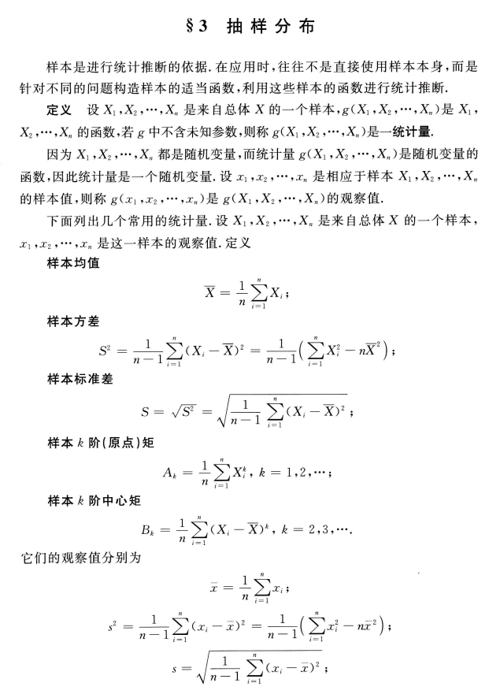
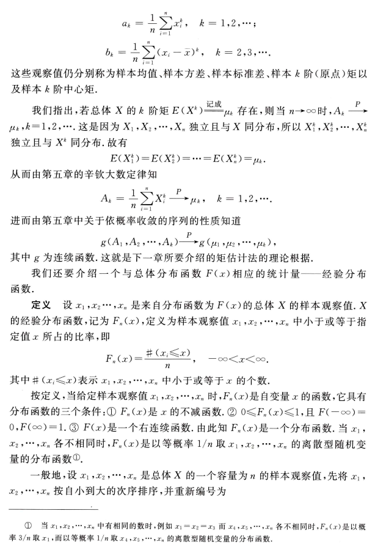
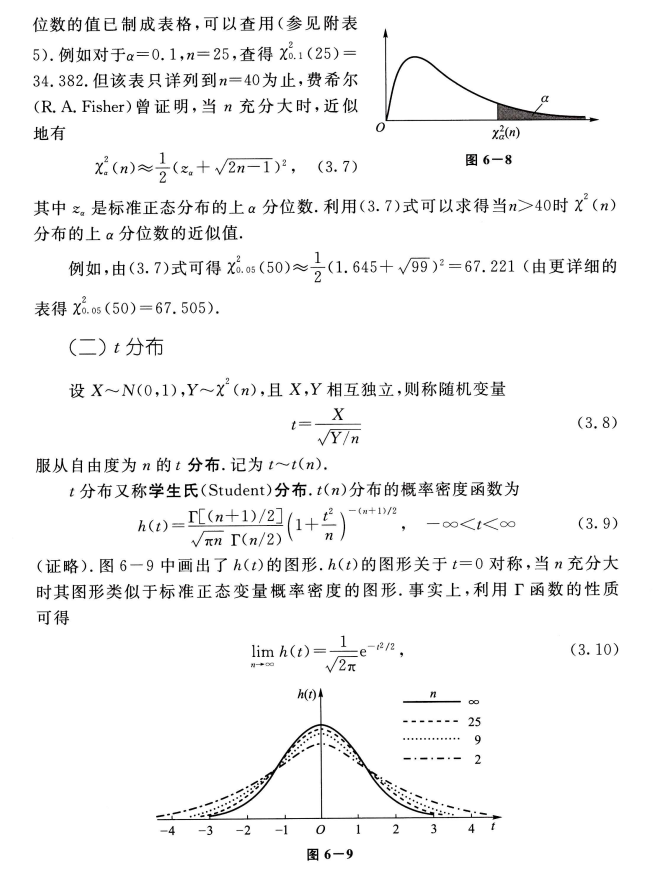

## §3 抽样分布

样本是进行统计推断的依据.在应用时，往往不是直接使用样本本身，而是
针对不同的问题构造样本的适当函数，利用这些样本的函数进行统计推断.
定义 设$X_1,X_2,\cdotp\cdotp\cdotp,X_n$ 是来自总体 $X$ 的一个样本$,g(X_1,X_2,\cdotp\cdotp\cdotp,X_n)$是 $X_1$,
$X_2,\cdotp\cdotp\cdotp,X_n$的函数，若$g$中不含未知参数，则称$g(X_1,X_2,\cdotp\cdotp\cdotp,X_n)$是一统计量
因为$X_1,X_2,\cdots,X_n$都是随机变量，而统计量$g(X_1,X_2,\cdots,X_n)$是随机变量的函数，因此统计量是一个随机变量.设$x_1,x_2,\cdotp\cdotp\cdotp,x_n$是相应于样本$X_1,X_2,\cdotp\cdotp\cdotp,X_n$ 的样本值，则称 $g(x_1,x_2,\cdots,x_n)$是 $g(X_1,X_2,\cdots,X_n)$的观察值.
下面列出几个常用的统计量.设$X_1,X_2,\cdotp\cdotp\cdotp,X_n$是来自总体$X$的一个样本，
$x_1,x_2,\cdots,x_n$ 是这一样本的观察值.定义
样本均值

$$\overline{X}=\frac{1}{n}\sum_{i=1}^nX_i\:;$$

样本方差

$$S^2=\frac{1}{n-1}\sum_{i=1}^n(X_i-\overline{X})^2=\frac{1}{n-1}\Big(\sum_{i=1}^nX_i^2-n\overline{X}^2\Big)\:;$$

样本标准差

$$S=\sqrt{S^2}\:=\:\sqrt{\frac{1}{n-1}\:\sum_{i=1}^{n}(X_i-\overline{X})^2}\:;$$

样本$k$阶(原点)矩

$$A_k\:=\:\frac{1}{n}\sum_{i=1}^nX_i^k\:,\:k\:=\:1\:,2\:,\cdots;$$

样本$k$阶中心矩

$$B_k=\frac{1}{n}\sum_{i=1}^n(X_i-\overline{X})^k,\:k=2,3,\cdots.$$

它们的观察值分别为

$$\overline{x}=\frac{1}{n}\sum_{i=1}^{n}x_{i}\:;$$

$$s^2=\frac{1}{n-1}\sum_{i=1}^n(x_i-\overline{x})^2=\frac{1}{n-1}\Big(\sum_{i=1}^nx_i^2-n\overline{x}^2\Big)\:;$$
$$s=\sqrt{\frac{1}{n-1}\sum_{i=1}^{n}(x_{i}-\overline{x})^{2}}\:;$$

$$a_k=\frac{1}{n}\sum_{i=1}^nx_i^k\:,\quad k=1,2,\cdots;$$
$$b_k=\frac{1}{n}\sum_{i=1}^n(x_i-\overline{x})^k,\quad k=2,3,\cdots.$$

这些观察值仍分别称为样本均值、样本方差、样本标准差、样本$k$ 阶(原点)矩以
及样本 $k$ 阶中心矩.
我们指出，若总体 $X$ 的$k$ 阶矩 $E(X^k)\xrightarrow\text{记成}\mu_k$ 存在，则当 $n\to\infty$时$,A_k\xrightarrow P$ $\mu_k,k=1,2,\cdots$.这是因为$X_1,X_2,\cdotp\cdotp\cdotp,X_n$独立且与$X$同分布，所以$X_1^k,X_2^k,\cdotp\cdotp\cdotp,X_n^k$ 独立且与$X^k$同分布.故有

$$E(X_1^k)=E(X_2^k)=\cdots=E(X_n^k)=\mu_k.$$

从而由第五章的辛钦大数定律知

$$A_k\:=\:\frac{1}{n}\sum_{i=1}^nX_i^k\:\xrightarrow{P}\mu_k\:,\quad k\:=\:1\:,2\:,\cdots.$$

进而由第五章中关于依概率收敛的序列的性质知道

$$g(A_1,A_2,\cdots,A_k)\xrightarrow{P}g(\mu_1,\mu_2,\cdots,\mu_k)\:,$$

其中 $g$ 为连续函数.这就是下一章所要介绍的矩估计法的理论根据.
我们还要介绍一个与总体分布函数 F(x)相应的统计量——经验分布
函数.
定义 设 $x_1,x_2\cdots,x_n$ 是来自分布函数为$F(x)$的总体 $X$ 的样本观察值$.X$ 的经验分布函数，记为$F_n(x)$,定义为样本观察值 $x_1,x_2,\cdotp\cdotp\cdotp,x_n$ 中小于或等于指定值$x$所占的比率，即

$$F_{_n}(x)=\frac{\#(x_i\leqslant x)}{n},\quad-\infty<x<\infty.$$

其中井$(x_i\leqslant x)$表示 $x_1,x_2,\cdotp\cdotp\cdotp,x_n$ 中小于或等于$x$ 的个数.
按定义，当给定样本观察值$x_1,x_2,\cdotp\cdotp\cdotp,x_n$时，$F_n(x)$是自变量$x$的函数，它具有分布函数的三个条件：$\textcircled{1}F_n(x)$是$x$ 的不减函数.$\textcircled{2}$ 0$\leqslant F_n(x)\leqslant1$,且 $F(-\infty)=$ $0, F( \infty ) = 1. \textcircled {3}$ $F( x)$是一个右连续函数.由此知$F_n(x)$是一个分布函数.当$x_1$, $x_{2},\cdots,x_{n}$ 各不相同时，$F_n(x)$是以等概率 1/n 取$x_1,x_{2},\cdots,x_{n}$ 的离散型随机变量的分布函数$^{\textcircled{1}}.$
一般地，设 $x_1,x_2,\cdotp\cdotp\cdotp,x_n$ 是总体 $X$ 的一个容量为 $n$ 的样本观察值，先将 $x_1$,
$x_2,\cdots,x_n$按自小到大的次序排序，并重新编号为

$\textcircled{1}$当$x_1,x_2,\cdotp\cdotp\cdotp,x_n$中有相同的数时，例如$x_1=x_2=x_3$而$x_4,x_5,\cdotp\cdotp\cdotp,x_n$各不相同时，$F_n(x)$是以概
率 3/n 取$x_1$,而以等概率$1/ n$ 取 $x_4, x_5, \cdotp \cdotp \cdotp , x_n$的离散型随机变量的分布函数
$$x_{(1)}\leqslant x_{(2)}\leqslant\cdots\leqslant x_{(n)}\:,$$

则经验分布函数 $F_n(x)$可写成

$$F_n(x)=\begin{cases}0\:,&x<x_{(1)}\:,\\k/n\:,&x_{(k)}\leqslant x<x_{(k+1)}\:,&k=1\:,2\:,\cdots,n-1\:,\\1\:,&x\geqslant x_{(n)}\:.\end{cases}$$

例如，设总体$X$有样本观察值$x_{(1)}=$ $-1,x_{(2)}=1,x_{(3)}=2$,得经验分布函数为$(如图6-6):$

$$F_3(x)=\begin{cases}0\:,&x<-1\:,\\1/3\:,&-1\leqslant x<1\:,\\2/3\:,&1\leqslant x<2\:,\\1\:,&x\geqslant2.\end{cases}$$

$图6-6$

另一方面，当给定$x$时，$F_n(x)$是样本$X_1,X_2,\cdotp\cdotp\cdotp,X_n$的函数，因此，它是一
个统计量.格里汶科(Glivenko)在 1933 年给出了以下的定理。
定理 1(格里汶科定理)设 $X_1,X_{2}^{\prime},\cdotp\cdotp\cdotp,X_{n}$ 是来自以$F(x)$为分布函数的总
体$X$的样本$,F(x)$是经验分布函数，则有

$$P\Big\{\lim\limits_{n\to\infty}\sup\limits_{-\infty<x<\infty}\mid F_{n}(x)-F(x)\mid=0\Big\}=1.$$

(证明略.)

定理 1 的含义是$F_n(x)$在整个实轴上以概率 1 均匀收敛于$F(x).$于是当样本容量$n$充分大时，$F_n(x)$能够良好地通近总体分布函数$F(x).$这是在概率统计学中以样本推断总体的依据.

$(-)\chi^2$分布

$$\chi^2=X_1^2+X_2^2+\cdots+X_n^2$$

(3.1)

设$X_1,X_2,\cdots,X_n$是来自总体 N(0,1)的样本，则称统计量
服从自由度为$n$ 的$\chi^2$分布，记为$\chi^2\sim\chi^2(n).$
此处，自由度是指(3.1)式右端包含的独立变量的个数
$\chi^2(n)$分布的概率密度为

(3.2)

$$f(y)=\begin{cases}\dfrac{1}{2^{n/2}\:\Gamma(n/2)}y^{n/2-1}\:\mathrm{e}^{-y/2}\:,&y>0\:,\\[2ex]0\:,&\text{其他}.\end{cases}$$
$f(y)$的图形如图 6-7 所示.

现在来推求(3.2)式.

留6-7

首先由第二章§5例3及第三章§5例 3知$\chi^{2}$(1)分布即为$\Gamma\left(\frac12,2\right)$分布. 现$X_i\sim N(0,1)$,由定义$X_i^2\sim\chi^2(1)$,即$X_i^2\sim\Gamma\left(\frac12,2\right),i=1,2,\cdots,n.$再由$X_1$, $X_2,\cdotp\cdotp\cdotp,X_n$的独立性知$X_1^2,X_2^2,\cdotp\cdotp\cdotp,X_n^2$相互独立，从而由$\Gamma$分布的可加性(见第三章§5例3)知
$$\chi^2=\sum_{i=1}^nX_i^2\sim\Gamma\Big(\frac{n}{2},2\Big),$$

(3.3)

即得$\chi^{^2}(n)$分布的概率密度如(3.2)式所示.
口
根据$\Gamma$分布的可加性易得$\chi^\mathrm{z}$分布的可加性如下：
$\chi^2$分布的可加性 设 $\chi_1^2\sim\chi^2(n_1),\chi_2^2\sim\chi^2(n_2)$,并且 $\chi_1^2,\chi_2^2$相互独立，则有
$\chi_1^2+\chi_2^2\sim\chi^2\left(n_1+n_2\right).$
(3.4)
$\chi^2$ 分布的数学期望和方差 若 $\chi^2\sim\chi^2(n)$,则有

$$E(\chi^{^2})=n,\quad D(\chi^{^2})=2n.$$

(3.5)

事实上，因 $X_i\sim N(0,1)$,故

$$E(X_i^2)=D(X_i)=1\:,$$

$D( X_{i}^{2}) = E( X_{i}^{4}) - [ E( X_{i}^{2}) ] ^{2}= 3- 1= 2$, $i= 1, 2, \cdots , n$

于是

$$E(\chi^{2})\:=\:E\Big(\:\sum_{i=1}^{n}X_{i}^{2}\:\Big)\:=\:\sum_{i=1}^{n}E(X_{i}^{2}\:)\:=\:n\:,\\D(\chi^{2})\:=\:D\Big(\:\sum_{i=1}^{n}X_{i}^{2}\Big)\:=\:\sum_{i=1}^{n}D(X_{i}^{2}\:)\:=\:2n.$$
$\chi^2$ 分布的上分位数 对于给定的正数 $\alpha,0<\alpha<1$,满足条件(参见 120 页)

$$P\{\chi^{2}>\chi_{_{a}}^{2}(n)\}=\int_{\chi_{a}^{2}(n)}^{\infty}f(y)\:\mathrm{d}y=\alpha $$
(3.6)
的$\chi_{a}^{2}(n)$就是$\chi^{2}(n)$分布的上 $\alpha$ 分 位 数 , 如 图 6- 8所 示 . 对 于 不 同 的  $\alpha , n$,上 $\alpha$ 分

位数的值已制成表格，可以查用(参见附表5).例如对于$_\alpha=0.1,n=25$,查得 $\chi_{0.1}^{2}(25)=$ 34.382.但 该 表 只 详 列 到 $n= 40$为 止 , 费 希 尔 (R. A. Fisher) 曾 证 明 , 当 $n$ 充 分 大 时 , 近 似地有

 图6-8

$$\chi_{_a}^{^2}(n)\approx\frac{1}{2}(z_{_a}+\sqrt{2n-1}\:)^{^2}\:,\quad(3.7)$$

其中$z_a$是标准正态分布的上$\alpha$分位数. 利用(3.7)式可以求得当$n>40$时$\chi^{2}(n)$
分布的上$\alpha$分位数的近似值，
例如，由(3.7)式可得$\chi_{0.05}^{2}(50)\approx\frac12(1.645+\sqrt{99})^{2}=67.221$(由更详细的
表得$\chi_{0.05}^2(50)=67.505).$

$(二)t$分布

设$X{\sim}N(0,1),Y{\sim}\chi^{2}(n)$,且$X,Y$相互独立，则称随机变量

(3.8)

$$t=\frac{X}{\sqrt{Y/n}}$$

服从自由度为$n$ 的$t$ 分布.记为 $t\sim t(n).$
$t$ 分布又称学生氏(Student)分布.$t(n)$分布的概率密度函数为
$$h\left(t\right)=\frac{\Gamma\left[\left(n+1\right)/2\right]}{\sqrt{\pi n}\:\Gamma\left(n/2\right)}\left(1+\frac{t^{2}}{n}\right)^{-\left(n+1\right)/2},\quad-\infty<t<\infty $$

(3.9)

(证略).图 6-9 中画出了$h(t)$的图形$.h(t)$的图形关于 $t=0$ 对称，当 $n$ 充分大时其图形类似于标准正态变量概率密度的图形.事实上，利用$\Gamma$函数的性质可得

(3.10)

故当$n$足够大时$\iota$分布近似于 N(0,1)分布.但对于较小的$n,t$分布与$N(0,1)$
分布相差较大(见附表 2 与附表 4).
$t$ 分 布 的 上 分 位 数 对 于 给 定 的 $\alpha , 0< \alpha < 1$,满足条件

$\alpha(3.11)$

$$P\{t>t_{a}(n)\}=\int_{t_{a}(n)}^{\infty}h(t)\mathrm{d}t=\alpha $$

的 $t_a(n)$就是 $t(n)$分布的上 $\alpha$ 分位数(如图 6-10).
由$t(n)$分布的上$\alpha$分位数的定义及
$h\left(t\right)$图形的对称性知

(3.12)

$$t_{1-a}(n)=-t_{a}(n).$$

$t$分布的上 α分位数可自附表 4 查得.当$n>45$时，对于常用的$\alpha$的值，就用正态近似

图6-10

(3.13)

$$t_{a}(n)\approx z_{a}.$$

$(\equiv)F$分布

设$U{\sim}\chi^2\left(n_1\right),V{\sim}\chi^2\left(n_2\right)$,且$U,V$ 相互独立，则称随机变量

$$F=\frac{U/n_1}{V/n_2}$$

(3.14)

服从自由度为$(n_1,n_2)$的$F$分布，记为$F\sim F(n_1,n_2)$
$F(n_1,n_2$)分布的概率密度为

$$\psi(y)=\begin{cases}\dfrac{\Gamma[(n_1+n_2)/2](n_1/n_2)^{n_1/2}y^{(n_1/2)-1}}{\Gamma(n_1/2)\Gamma(n_2/2)[1+(n_1y/n_2)]^{(n_1+n_2)/2}},&y>0\:,\\0\:,&\text{其他}\end{cases}$$

(3.15)

(证略).图 6-11 中画出了$\psi(y)$的图形.

由定义可知，若 $F\sim F(n_1,n_2)$,则

(3.16)

$$\frac{1}{F}{\sim}F(n_{2},n_{1}).$$

$F$ 分 布 的 上 分 位 数  对 于 给 定 的  $\alpha , 0< \alpha < 1$,满足条件

$\alpha(3.17)$

$$P\{F>F_a(n_1,n_2)\}=\int_{F_a(n_1,n_2)}^{\infty}\psi(y)\:\mathrm{d}y=\alpha $$

的$F_a(n_1,n_2)$就是$F(n_1,n_2)$分布的上$\alpha$分位数(图 6-12).$F$分布的上$\alpha$分位数
有表可查(见附表 6).

类似地有$\chi^2$分布$,t$ 分布$,F$ 分布
的下分位数.
$F$分布的上$\alpha$分位数有如下的重
要性质$^{\textcircled{1}}$

$$F_{_{1-_a}}(\:n_1\:,n_2\:)=\frac{1}{F_{_a}(\:n_2\:,n_1\:)}.$$

图6-12

(3.18)

(3.18)式常用来求$F$分布表中未列出的常用的上$\alpha$分位数.例如，

$$F_{0.95}(12,9)=\frac{1}{F_{0.05}(9,12)}=\frac{1}{2.80}=0.357.$$

(四)正态总体的样本均值与样本方差的分布

设总体$X$(不管服从什么分布，只要均值和方差存在)的均值为$\mu$,方差为$\sigma^2$,
$X_1,X_2,\cdots,X_n$ 是来自 $X$ 的一个样本$,\overline{X},S^2$ 分别是样本均值和样本方差，则有

(3.19)

$$E(\overline{X})=_\mu,\quad D(\overline{X})=_{\sigma^2}/n.$$
$$E(S^2)=E\Bigg[\frac{1}{n-1}\Big(\sum_{i=1}^nX_i^2-n\overline{X}^2\Big)\Bigg]=\frac{1}{n-1}\Bigg[\sum_{i=1}^nE(X_i^2)-nE(\overline{X}^2)\Bigg]$$

而

$\textcircled {1}$ (3,18)式的证明如下：若 $F\sim F(n_1,n_2)$,按定义
$$\begin{aligned}1-_{\alpha}&=P\langle\:F>F_{1-a}(\:n_{1}\:,n_{2}\:)\:\rangle=P\left\{\:\frac{1}{F}<\frac{1}{F_{1-a}(\:n_{1}\:,n_{2}\:)}\:\right\}\\&=1-P\left\{\frac{1}{F}\geqslant\frac{1}{F_{1-a}(n_{1},n_{2})}\right\}=1-P\left\{\frac{1}{F}>\frac{1}{F_{1-a}(n_{1},n_{2})}\right\},\\\end{aligned}$$
$$P\left\{\frac{1}{F}>\frac{1}{F_{1-a}(n_{1},n_{2})}\right\}=a.$$
$$P\left\{\frac{1}{F}>F_{a}\left(n_{2},n_{1}\right)\right\}=a.$$

于是

比较(1),(2)两式得

$$\frac{1}{F_{1-a}(n_{1},n_{2})}=F_{a}(n_{2},n_{1}),\text{即}F_{1-a}(n_{1},n_{2})=\frac{1}{F_{a}(n_{2},n_{1})}.$$

(1)

(2)

$$=\frac{1}{n-1}\Bigg[\sum_{i=1}^{n}(\sigma^2+\mu^2)-n(\sigma^2/n+\mu^2)\Bigg]=\sigma^2\:,$$
$$E(S^2)\:=\:\sigma^2.$$

即

(3.20)

进而，设总体$X\sim N(\mu,\sigma^2)$,由第四章§2的(2.8)式知$\overline{X}=\frac1n\sum_{i=1}^nX_i$也服
从正态分布，于是得到以下的定理：
定理 2 设$X_1,X_2,\cdotp\cdotp\cdotp,X_n$是来自正态总体$N(\mu,\sigma^2)$的样本，$\overline{X}$是样本均
值，则有

$$\overline{X}{\sim}N(\mu,\sigma^{2}/n).$$

均值和样本方差，则有
$$1^{\circ}\:\frac{(\:n-1\:)\:S^{2}}{\sigma^{2}}\:\sim\:\chi^{2}\:(\:n-1\:).$$

对于正态总体$\mathcal{N}(\mu,\sigma^2$)的样本均值$\overline{X}$和样本方差 S$^2$,有以下两个重要
定理.
定理 3 设 $X_1,X_2,\cdotp\cdotp\cdotp,X_n$ 是来自总体 $N(\mu,\sigma^2)$的样本$,\overline{X},S^2$ 分别是样本
(3.21)
$2^{\circ }$ $\overline {X}$与 $S^2$ 相互独立.
定理 3 的证明见本章末二维码.
定理 4 设$X_1,X_2,\cdotp\cdotp\cdotp,X_n$是来自总体 N( $\mu,\sigma^2$)的样本$,\overline{X},S^2$分别是样本
均值和样本方差，则有
$$\frac{\overline{X}-\mu}{S/\sqrt{n}}\sim t(n-1).$$

(3.22)

证 由定理 2、定理 3,

$$\frac{\overline{X}-\mu}{\sigma/\sqrt{n}}\sim N(0,1)\:,\quad\frac{(n-1)S^{2}}{\sigma^{2}}\sim\chi^{2}(n-1)\:,$$

且两者独立.由$t$ 分布的定义知

$$\frac{\overline{X}-\mu}{\sigma/\sqrt{n}}\Big/\sqrt{\frac{(n-1)S^{2}}{\sigma^{2}(n-1)}}\sim t(n-1).$$

口

化简上式左边，即得(3.22)式.
对于两个正态总体的样本均值和样本方差有以下的定理
定理 5 设 $X_1,X_2,\cdots,X_{n_1}$与 $Y_1,Y_2,\cdots,Y_{n_2}$分别是来自正态总体 $N(\mu_1,\sigma_1^2)$和$\underline{N(\mu_{2},\sigma_{2}^{2})\text{的样本，且这两个样本相互独立}^{0}.\text{设 }\overline{X}=\frac{1}{n_{1}}\sum_{i=1}^{{n_{1}}}X_{i},\overline{Y}=\frac{1}{n_{2}}\sum_{i=1}^{{n_{2}}}Y_{i}\text{ 分别}_{i}\text{ 分别}_{i}\:{\text{ 小}}_{i}\text{ 分别}_{i}\:_{i}\text{ 分别}_{i}\:_{i}\:_{i\:i\text{ 分别}}_{i\:i\:}_{i\:i\text{ 分别}}_{i\:i\:}_{i\:i\:}_{i\:$

$\textcircled {1}$ 这里指随机向量($X_1,X_2,\cdots,X_{n_1}$)与($Y_1,Y_2,\cdots,Y_{n_2}$)相互独立.
是这两个样本的样本均值；$S_1^2=\frac1{n_1-1}\sum_{i=1}^{n_1}(X_i-\overline{X})^2,S_2^2=\frac1{n_2-1}\sum_{i=1}^{n_2}(Y_i-\overline{Y})^2$

分别是这两个样本的样本方差，则有

$1°\frac{S_{1}^{2}/S_{2}^{2}}{\sigma_{1}^{2}/\sigma_{2}^{2}}\sim F(n_{1}-1,n_{2}-1).$
$2^{\circ}$当$\sigma_1^2=\sigma_2^2=\sigma^2$时，

$\frac {( \overline {X}- \overline {Y}) - ( \mu _{1}- \mu _{2}) }{S_{\mathrm{w} }\sqrt {\frac 1{n_{1}}+ \frac 1{n_{2}}}}\sim t( n_{1}+ n_{2}- 2)$ ,
$$S_{\mathrm{W}}^{2}=\frac{(n_{1}-1)S_{1}^{2}+(n_{2}-1)S_{2}^{2}}{n_{1}+n_{2}-2},\quad S_{\mathrm{W}}=\sqrt{S_{\mathrm{W}}^{2}}\:.$$

其中

证 1°由定理 3,

$$\frac{(n_1-1)S_1^2}{\sigma_1^2}\sim\chi^2(n_1-1)\:,\quad\frac{(n_2-1)S_2^2}{\sigma_2^2}\sim\chi^2(n_2-1)\:.$$

由假设$S_1^2,S_2^2$相互独立，则由$F$分布的定义知

$$\frac{(n_1-1)S_1^2}{(n_1-1)\sigma_1^2}\Big/\frac{(n_2-1)S_2^2}{(n_2-1)\sigma_2^2}\sim F(n_1-1,n_2-1)\:,$$

即

$$\frac{S_1^2/S_2^2}{\sigma_1^2/\sigma_2^2}\sim F(n_1-1,n_2-1).$$

$2^{\circ }$ $易 知$ $\overline {X}- \overline {Y}\sim N\left ( \mu _{1}- \mu _{2}\:, \frac {\sigma ^{2}}{n_{1}}+ \frac {\sigma ^{2}}{n_{2}}\right )$,即有
$$U=\frac{(\overline{X}-\overline{Y})-(\mu_{1}-\mu_{2})}{\sigma\sqrt{\frac{1}{n_{1}}+\frac{1}{n_{2}}}}\sim N(0,1).$$

又由给定条件知

$$\frac{(n_1-1)S_1^2}{\sigma^2}\sim\chi^2(n_1-1)\:,\quad\frac{(n_2-1)S_2^2}{\sigma^2}\sim\chi^2(n_2-1)\:,$$

且它们相互独立，故由$\chi^{2}$分布的可加性知

$$V=\frac{(n_{1}-1)S_{1}^{2}}{\sigma^{2}}+\frac{(n_{2}-1)S_{2}^{2}}{\sigma^{2}}{\sim}\chi^{2}(n_{1}+n_{2}-2).$$

由本章末所附“§3定理 3 的证明及其推广”的 2°知$U$与$V$相互独立.从而按$t$
分布的定义知
$$\frac{U}{\sqrt{V/(n_{1}+n_{2}-2)}}=\frac{(\overline{X}-\overline{Y})-(\mu_{1}-\mu_{2})}{S_{w}\sqrt{\frac{1}{n_{1}}+\frac{1}{n_{2}}}}\sim t(n_{1}+n_{2}-2).\quad\square $$

本节所介绍的几个分布以及后四个定理，在下面各章中都起着重要的作用.
应注意，它们都是在总体为正态总体这一基本假定下得到的.
小结

在数理统计中往往研究有关对象的某一项数量指标.对这一数量指标进行试验或观察， 将试验的全部可能的观察值称为总体，每个观察值称为个体.总体中的每一个个体是某一随机变量$X$的值，因此一个总体对应一个随机变量 X. 我们将不区分总体与相应的随机变量$X$,笼统称为总体$X.$随机变量$X$服从什么分布，就称总体服从什么分布.在实际中遇到的总体往往是有限总体，它对应一个离散型随机变量. 当总体中包含的个体的个数很大时，在理论上可以认为它是一个无限总体.我们说某种型号的灯泡寿命总体服从指数分布，是指无限总体而言的.又如我们说某一年龄段的男性儿童的身高服从正态分布，也是指无限总体而言的.无限总体是人们对具体事物的抽象.无限总体的分布的形式较为简明，便于在数学上进行处理，使用方便.
在相同的条件下，对总体$X$进行$n$次重复的、独立的观察，得到$n$个结果$X_1,X_2,\cdotp\cdotp\cdotp,X_n$,称
随机变量$X_1,X_2,\cdotp\cdotp\cdotp,X_n$为来自总体$X$的简单随机样本，它具有两条性质：
$1^{\circ }$ $X_1, X_2, \cdotp \cdotp \cdotp , X_n$ 都与总体具有相同的分布.
$2^{\circ }$ $X_1$ $, X_2$ $, \cdots , X_n$相互独立.

我们就是利用来自样本的信息推断总体，得到有关总体分布的种种结论的 .

样本 $X_1,X_2,\cdots,X_n$ 的函数 $g(X_1,X_2,\cdots,X_n)$,若不包含未知参数，则称为统计量.统计量

是一个随机变量，它是完全由样本所确定的.统计量是进行统计推断的工具.样本均值

$$\overline{X}=\frac{1}{n}\sum_{k=1}^{n}X_{k}$$

和样本方差

$$S^2=\frac{1}{n-1}\sum_{k=1}^n(X_k-\overline{X})^2$$

是两个最重要的统计量.统计量的分布称为抽样分布.下面是三个来自正态分布的抽样分布：
$\chi^2$分布，$t$分布，$F$分布.
这三个分布称为统计学的三大分布，它们在数理统计中有着广泛的应用.对于这三个分布，
要求读者掌握它们的定义和概率密度函数图形的轮廓，还会使用分位数表写出分位数.
关于样本均值$\overline{X}$、样本方差$S^2$,有以下的结果.
1.设$X_1,X_2,\cdotp\cdotp\cdotp,X_n$是来自总体$X$(不管服从什么分布，只要它的均值和方差存在)的样
本，且有$E(X)=\mu,D(X)=\sigma^{2}$,则有
$E( \overline {X}) = _{\mu }$, $D( \overline {X}) = \sigma ^{2}/ n.$

2.设总体$X\sim N(\mu,\sigma^{2}),X_{1},X_{2},\cdotp\cdotp\cdotp,X_{n}$是来自$X$的样本，则有
$1^{\circ }$ $\overline {X}\sim N( \mu , \sigma ^{2}/ n) .$
$2^{\circ }$ $\frac {( n- 1) S^{2}}{\sigma ^{2}}\sim \chi ^{2}( n- 1) .$
$3^{\circ }$ $\overline {X}$与$S^2$相互独立.
$$4^{\circ}\:\frac{\overline{X}-\mu}{S/\sqrt{n}}\sim t(n-1).$$
3. 对于两个正态总体 $X\sim N(\mu_1,\sigma_1^2),Y\sim N(\mu_2,\sigma_2^2)$,有§3定理 5 的重要结果 .
◼重要术语及主题

总体 简单随机样本 统计量
$\chi^2$分布、$t$分布、$F$分布的定义及它们的概率密度函数图形轮廓

上 $\alpha$ 分位数 $F_{1- a}( n_{1}, n_{2}) = \frac 1{F_{a}( n_{2}, n_{1}) }$

小结中关于样本均值、样本方差的重要结果

习题

$\mathbf{1}$.在总体 N(52,6.3$^{2}$)中随机抽取一容量为 36 的样本，求样本均值$\overline{X}$落在 50.8 到53.8
之间的概率。
2.在总体 N(12,4)中随机抽一容量为5 的样本$X_1,X_2,X_3,X_4,X_5.$
(1)求样本均值与总体均值之差的绝对值大于 1 的概率，
(2)求概率$P\langle\max\langle X_1,X_2,X_3,X_4,X_5\rangle>15\rangle,P\langle\min\{X_1,X_2,X_3,X_4,X_5\rangle<10\rangle.$
3.求总体 N(20,3)的容量分别为 10,15 的两独立样本均值差的绝对值大于 0.3 的
概率.
4.(1)设样本$X_1,X_2,\cdotp\cdotp\cdotp,X_6$来自总体$N(0,1),Y=(X_1+X_2+X_3)^2+(X_4+X_5+X_6)^2$,
试确定常数 $C$ 使 CY服从$\chi^{2}$ 分布.
(2)设样本 $X_{1},X_{2},\cdots,X_{5}$ 来自总体 N$(0,1),Y=\frac{\mathrm{C}(X_{1}+X_{2})}{(X_{3}^{2}+X_{4}^{2}+X_{5}^{2})^{1/2}}$,试确定常数 $C$ 使 Y
服从$t$分布.
(3)已知总体 $X\sim_t(n)$,求证 $X^2\sim F(1,n).$
5.(1)已知某种能力测试的得分服从正态分布 $N(\mu,\sigma^2)$,随机取 10 个人参与这一测试.
求他们得分的联合概率密度，并求这 10 个人得分的平均值小于$\mu$的概率，
(2)在(1)中设 $\mu=62,\sigma^{2}=25$,若得分超过 70 就能得奖，求至少有一人得奖的概率，
6.设总体$X\sim b(1,p),X_1,X_2,\cdots,X_n$是来自$X$的样本.
(1)求$(X_1,X_{2},\cdots,X_{n})$的分布律.
(2)求$\sum_i=1^nX_i$的分布律.
$(3)求E(\overline{X}),D(\overline{X}),E(S^{2}).$
7.设总体$X\sim\chi^{2}(n),X_{1},X_{2},\cdots,X_{10}$是来自$X$的样本，求$E(\overline X),D(\overline X),E(S^{2}).$
8. 设总体 $X\sim N(\mu,\sigma^{2}),X_{1},X_{2},\cdots,X_{10}$是来自$X$ 的样本.
(1)写出 $X_1,X_2,\cdots,X_{10}$的联合概率密度.
(2)写出$\overline{X}$的概率密度.
9. 设在总体$N(\mu,\sigma^2)$中抽得一容量为 16 的样本，这里$\mu,\sigma^2$均未知
$(1)求P\{S^{2}/\sigma^{2}\leqslant2.041\}$,其中$S^2$为样本方差.
(2)求$D(S^2).$