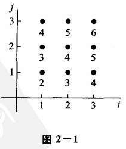
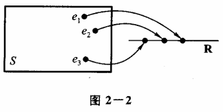

# 第二章 随机变量及其分布

## §1 随机变量

在第一章我们看到一些随机试验，它们的结果可以用数来表示。此时样本空间 $S$ 的元素是一个数，如 $S_3, S_5 $；但有些则不然，如 $S_1, S_2 $。当样本空间 $S$ 的元素不是一个数时，人们对于 $S$ 就难以描述和研究。现在来讨论如何引入一个法则，将随机试验的每一个结果，即将 $S$ 的每个元素 $e$ 与实数 $x$ 对应起来，从而引入了随机变量的概念。我们从例题开始讨论。

**例 1** 在第一章 §4 例 1 中，将一枚硬币抛掷三次，观察出现正面和反面的情况，样本空间是
 $S = \lbrace HHH, HHT, HTH, HTT, THH, THT, TTH, TTT\rbrace $.

以 $X$ 记三次投掷得到正面 $H$ 的总数，那么，对于样本空间 $S = \lbrace e\rbrace^{①}$ 中的每一个样本点 $e $， $X$ 都有一个数与之对应。 $X$ 是定义在样本空间 $S$ 上的一个实值单值函数。它的定义域是样本空间 $S $，值域是实数集合 $\lbrace 0, 1, 2, 3\rbrace $。使用函数记号可将 $X$ 写成

 $$
X = X(e) = 
\begin{cases} 
3, & e = HHH, \\ 
2, & e = HHT, HTH, THH, \\ 
1, & e = HTT, THT, TTH, \\ 
0, & e = TTT. 
\end{cases}
 $$

**例 2** 在一袋中装有编号分别为 $1, 2, 3$ 的 $3$ 只球，在袋中任取一只球，放回，再任取一只球，记录它们的号码，试验的样本空间为 $S = \lbrace e\rbrace = \lbrace (i, j) \mid i, j = 1, 2, 3\rbrace $， $i, j$ 分别为第 $1 $、第 $2$ 次取到的球的号码。以 $X$ 记两球号码之和。我们看到，对于试验的每一个结果 $e = (i, j) \in S $， $X$ 都有一个指定的值 $i + j$ 与之对应如（[图2-1](#图2-1)）。 $X$ 是定义在样本空间 $S$ 上的单值实值函数。它的定义域是样本空间 $S $。值域是实数集合 $\lbrace 2, 3, 4, 5, 6\rbrace $。

① 我们用 $e$ 代表样本空间的元素，而将样本空间记成 $\lbrace e\rbrace $。

 $X$ 可写成
 $X = X(e) = X((i, j)) = i + j, \quad i, j = 1, 2, 3 $.

一般有以下的定义。

**定义** 设随机试验的样本空间为 $S = \lbrace e\rbrace $。 $X = X(e)$ 是定义在样本空间 $S$ 上的实值单值函数。称 $X = X(e)$ 为随机变量 $^{①} $。

[图2-2](#图2-2)画出了样本点 $e$ 与实数 $X = X(e)$ 对应的示意图。

有许多随机试验，它们的结果本身是一个数，即样本点 $e$ 本身是一个数。我们令 $X = X(e) = e $，那么 $X$ 就是一个随机变量。例如，用 $Y$ 记某车间一天的缺勤人数，以 $W$ 记某地区第一季度的降雨量，以 $Z$ 记某工厂一天的耗电量，以 $N$ 记某医院某一天的挂号人数。